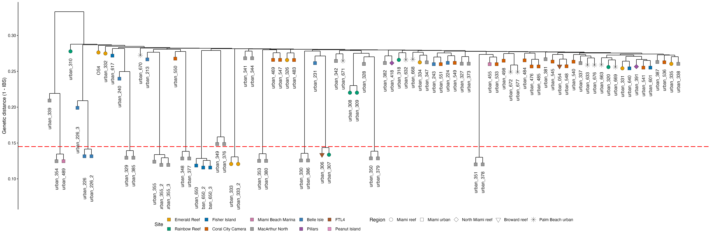

```{r setup, include=FALSE}
knitr::opts_chunk$set(echo = TRUE, eval = FALSE)
```

<a href="https://github.com/mstudiva/Urban-coral-population-genetics" class="github-corner" aria-label="View source on GitHub"><svg width="80" height="80" viewBox="0 0 250 250" style="fill:#2C3E50; color:#fff; position: absolute; top: 0; border: 0; right: 0;" aria-hidden="true"><path d="M0,0 L115,115 L130,115 L142,142 L250,250 L250,0 Z"></path><path d="M128.3,109.0 C113.8,99.7 119.0,89.6 119.0,89.6 C122.0,82.7 120.5,78.6 120.5,78.6 C119.2,72.0 123.4,76.3 123.4,76.3 C127.3,80.9 125.5,87.3 125.5,87.3 C122.9,97.6 130.6,101.9 134.4,103.2" fill="currentColor" style="transform-origin: 130px 106px;" class="octo-arm"></path><path d="M115.0,115.0 C114.9,115.1 118.7,116.5 119.8,115.4 L133.7,101.6 C136.9,99.2 139.9,98.4 142.2,98.6 C133.8,88.0 127.5,74.4 143.8,58.0 C148.5,53.4 154.0,51.2 159.7,51.0 C160.3,49.4 163.2,43.6 171.4,40.1 C171.4,40.1 176.1,42.5 178.8,56.2 C183.1,58.6 187.2,61.8 190.9,65.4 C194.5,69.0 197.7,73.2 200.1,77.6 C213.8,80.2 216.3,84.9 216.3,84.9 C212.7,93.1 206.9,96.0 205.4,96.6 C205.1,102.4 203.0,107.8 198.3,112.5 C181.9,128.9 168.3,122.5 157.7,114.1 C157.9,116.9 156.7,120.9 152.7,124.9 L141.0,136.5 C139.8,137.7 141.6,141.9 141.8,141.8 Z" fill="currentColor" class="octo-body"></path></svg></a>

```{=html}
<style>.github-corner:hover .octo-arm{animation:octocat-wave 560ms ease-in-out}@keyframes octocat-wave{0%,100%{transform:rotate(0)}20%,60%{transform:rotate(-25deg)}40%,80%{transform:rotate(10deg)}}@media (max-width:500px){.github-corner:hover .octo-arm{animation:none}.github-corner .octo-arm{animation:octocat-wave 560ms ease-in-out}}</style>
```

#### version: `r library(magrittr)` `r Sys.Date() %>% format(format="%d %B, %Y")`

#### [GitHub repository](https://github.com/mstudiva/Urban-coral-population-genetics){target="_blank"}

## A B O U T &nbsp; T H I S &nbsp; D O C U M E N T

This walkthrough describes the downstream processing and analysis of 2bRAD reads generated from *Diploria labyrinthiformis* samples collected across urbanized and reef habitats in southeast Florida. Sequence alignments are based on an existing genome assembly by the Aquatic Symbiosis Genomics Project: https://www.aquaticsymbiosisgenomics.org/. For initial processing of 2bRAD reads regardless of species, please see below: 

- [2bRAD processing](https://mstudiva.github.io/Urban-coral-population-genetics/code/)

Library prep, bioinformatics, and analysis protocols are credited to the 2bRAD pipeline originally developed by Misha Matz: https://doi.org/10.1038/nmeth.2023, and further refined by Ryan Eckert: https://ryaneckert.github.io/Stephanocoenia_FKNMS_PopGen/code/ 

<br>

***
## M A P P I N G &nbsp; T O &nbsp; R E F E R E N C E
***

### Formatting genome assembly with Bowtie2
```{bash, db}
mkdir ~/db/symGenomes
cd ~/db/symGenomes
```

Using Symbiodiniaceae references from NCBI's most recent genomes:
Symbiodinium (NCBI GCA_965279495.1), Breviolum (GCA_965643015.1), Cladocopium (GCA_947184155.2), Durusdinium (GCA_963970005.1)

```{bash, concat sym}
python concatFasta.py -o symbConcatGenome.fasta -s symbConcatGenome_summary.tsv -m symbConcatGenome_contig_to_fakechr.tsv GCA_965279495.1_pySymTrid1.1_genomic.fna GCA_965643015.1_pyBreMinu3.1_genomic.fna GCA_947184155.2_Cgoreaui_SCF055-01_v2.1_genomic.fna GCA_963970005.1_Durusdinium_trenchii_CCMP2556_genomic.fna
```

Building bowtie2 index for concatenated symbiont genomes
```{bash, bowtie build}
conda activate 2bRAD
echo '#!/bin/bash' >genomeBuild.sh
echo bowtie2-build symbConcatGenome.fasta symbConcatGenome >>genomeBuild.sh
echo samtools faidx symbConcatGenome.fasta >>genomeBuild.sh
sbatch -o genomeBuild.o%j -e genomeBuild.e%j --mail-type=ALL --mail-user=studivanms@gmail.com genomeBuild.sh
```

Building bowtie2 index for *D. labyrinthiformis* genome
```{bash, bowtie build 2}
conda activate 2bRAD
echo '#!/bin/bash' >genomeBuild.sh
echo bowtie2-build GCA_965282425.1_jaDipLaby1.1_genomic.fna DlabyrinthiformisGenome >>genomeBuild.sh
echo samtools faidx GCA_965282425.1_jaDipLaby1.1_genomic.fna >>genomeBuild.sh
sbatch -o genomeBuild.o%j -e genomeBuild.e%j --mail-type=ALL --mail-user=studivanms@gmail.com genomeBuild.sh
```

<br>

### Aligning reads to concatenated symbiont genomes
```{bash, bowtie align}
conda activate 2bRAD
SYMGENOME=~/db/symGenomes/symbConcatGenome
2bRAD_bowtie2_launcher.py -g $SYMGENOME -f trim -n zooxMaps --split -u un -a zoox --launcher -e studivanms@gmail.com
sbatch zooxMaps.slurm

mkdir ../mappedReads
mkdir ../mappedReads/symbionts
mv *.sam ../mappedReads/symbionts
mv *.zoox ../mappedReads/symbionts
cd ../mappedReads/symbionts
```

Do we have the correct number of files?
```{bash, check count 3}
ll *.zoox | wc -l
```

Counting the mapped symbiont reads
```{bash, countmapped}
echo '#!/bin/bash' >mappedZooxReads
echo readCounts.sh -e zoox -o Zoox >>mappedZooxReads
sbatch --mem=200GB --mail-type=ALL --mail-user=studivanms@gmail.com mappedZooxReads
```
scp ZooxReadCounts to local machine

<br>

Making script to generate indexed bam files
```{bash, sam2bam}
>s2b
for file in *.sam; do
echo "samtools sort -O bam -o ${file/.sam/}.bam $file && samtools index ${file/.sam/}.bam">>s2b;
done
launcher_creator.py -j s2b -n s2b -t 6:00:00 -N 5 -e studivanms@gmail.com -q shortq7
sbatch s2b.slurm
```

Counting the symbiont reads by genera
```{bash, zooxcounts}
>ZooxReads
for i in *.bam; do
echo $i >>ZooxReads;
samtools idxstats $i | cut -f 1,3 >>ZooxReads;
done
```
scp ZooxReads to local machine

<br>

Housekeeping for long-term storage
```{bash, housekeeping 2}
zipper.py -a -9 -f sam --launcher -e studivanms@gmail.com
sbatch zip.slurm

zipper.py -a -9 -f zoox --launcher -e studivanms@gmail.com
sbatch zip.slurm
```

<br>

### Aligning remaining reads to coral genome
```{bash, bowtie align 2}
cd ~/urban/dlab/filteredReads
conda activate 2bRAD
HOSTGENOME=~/db/dlabGenome/DlabyrinthiformisGenome
mkdir junk
# mapping with --local option, enables clipping of mismatching ends (guards against deletions near ends of RAD tags)
2bRAD_bowtie2_launcher.py -g $HOSTGENOME -f un --split -u junk -a host --undir junk --launcher -e studivanms@gmail.com
sbatch --mem=200GB maps.slurm
```

Do we have the correct number of files?
```{bash, check count 4}
ll *.sam | wc -l
```

Counting the mapped coral reads
```{bash, countmapped 2}
echo '#!/bin/bash' >mappedReads
echo readCounts.sh -e al -o Host >>mappedReads
sbatch --mem=200GB --mail-type=ALL --mail-user=studivanms@gmail.com mappedReads
```
scp HostReadCounts to local machine

<br>

Making script to generate indexed bam files
```{bash, sam2bam 2}
>s2b
for file in *.sam; do
echo "samtools sort -O bam -o ${file/.sam/}.bam $file && samtools index ${file/.sam/}.bam">>s2b;
done

launcher_creator.py -j s2b -n s2b -q shortq7 -t 06:00:00 -e studivanms@gmail.com
sbatch --mem=200GB s2b.slurm

ll *bam | wc -l
```

Housekeeping for long-term storage
```{bash, housekeeping 3}
zipper.py -a -9 -f sam --launcher -e studivanms@gmail.com
sbatch zip.slurm

zipper.py -a -9 -f un --launcher -e studivanms@gmail.com
sbatch zip.slurm

zipper.py -a -9 -f trim --launcher -e studivanms@gmail.com
sbatch zip.slurm

zipper.py -a -9 -f host --launcher -e studivanms@gmail.com
sbatch zip.slurm

mv *.trim.gz ../../trimmedReads
mv *.sam.gz ../mappedReads
mv *.host.gz ../mappedReads
mv *.bam ../mappedReads
mv *.bai ../mappedReads

cd junk
zipper.py -a -9 -f junk --launcher -e studivanms@gmail.com
sbatch zip.slurm
```

<br>

***
## G E N O T Y P I N G 
***

### Genotyping with ANGSD 
Doesn't call actual genotypes, but instead generates genotype likelihoods at each SNP. Optimal for low-coverage data (<10x) like 2bRAD.

Copy all *.bam* files to a new directory 'ANGSD'
```{bash, bams}
mkdir ../ANGSD
cd ../ANGSD
mv ../mappedReads/*.bam* .

ls *bam >bamsClones
```

Assessing base qualities and coverage depth
```-minMapQ 20```: only highly unique mappings (prob of erroneous mapping =< 1%)
```-baq 1```: realign around indels (not terribly relevant for 2bRAD reads mapped with --local option)
```-maxDepth```: highest total depth (sum over all samples) to assess; set to 10x number of samples
```-minInd```: the minimal number of individuals the site must be genotyped in. Set to 50% of total N at this stage.
```{bash, ANGSD}
export FILTERS="-uniqueOnly 1 -remove_bads 1 -minMapQ 20 -maxDepth 910 -minInd 45"
export TODO="-doQsDist 1 -doDepth 1 -doCounts 1 -dumpCounts 2"

echo '#!/bin/bash' >dlabDD.sh
echo angsd -b bamsClones -GL 1 $FILTERS $TODO -P 1 -out dd -nThreads 20 >>dlabDD.sh

sbatch --mem=200GB -o dlabDD.o%j -e dlabDD.e%j --mail-user=studivanms@gmail.com --mail-type=ALL --partition=shortq7 dlabDD.sh
```

Summarizing results
```{bash, ANGSD results}
module load R/3.6.1
echo '#!/bin/bash' >RQC.sh
echo Rscript ~/bin/plotQC.R prefix=dd >>RQC.sh
echo gzip -9 dd.counts >>RQC.sh
sbatch -e RQC.e%j -o RQC.o%j --dependency=afterok:460550 --mem=200GB --mail-type=ALL --mail-user=studivanms@gmail.com RQC.sh
```

Proportion of sites covered at >5X:
```{bash, }
cat quality.txt
```
scp dd.pdf to local machine to look at distribution of base quality scores, fraction of sites in each sample passing coverage thresholds and fraction of sites passing genotyping rates cutoffs. Use these to guide choices of ```-minQ```,  ```-minIndDepth``` and ```-minInd``` filters in subsequent ```ANGSD``` runs.  


<br>

### Identifying clones and technical replicates
Set the ```-minInd``` flag to 80% of the number of samples you have
```{bash, ANGSD 2}
FILTERS="-uniqueOnly 1 -remove_bads 1 -minMapQ 20 -minQ 30 -dosnpstat 1 -doHWE 1 -hwe_pval 1e-5 -sb_pval 1e-5 -hetbias_pval 1e-5 -skipTriallelic 1 -minInd 72 -snp_pval 1e-6 -minMaf 0.05"
TODO="-doMajorMinor 1 -doMaf 1 -doCounts 1 -makeMatrix 1 -doIBS 1 -doCov 1 -doGeno 8 -doBcf 1 -doPost 1 -doGlf 2"

echo '#!/bin/bash' > dlabClones.sh
echo angsd -b bamsClones -GL 1 $FILTERS $TODO -P 1 -out dlabClones >>dlabClones.sh

sbatch --mem=200GB -o radClones.o%j -e radClones.e%j --mail-type=ALL --mail-user=studivanms@gmail.com --partition=shortq7 radClones.sh
```

<br>

scp .ibsMat and .bcf files to local machine
Use ibs matrix to identify clones with hierachial clustering in ```R```. ```scp``` to local machine and run chunk below in ```R```

```{r, Dendrogram With Clones, fig.width=13, fig.height=4.75, dpi=150, out.width="100%"}
pacman::p_load("dendextend", "ggdendro", "tidyverse")

cloneBams = read.csv("../../data/dlab/dlabMetadata.csv") # list of bam files

cloneMa = as.matrix(read.table("../../data/dlab/ANGSD/clones/dlabClones.ibsMat")) # reads in IBS matrix produced by ANGSD 

dimnames(cloneMa) = list(cloneBams[,2],cloneBams[,2])
clonesHc = hclust(as.dist(cloneMa),"ave")

clonePops = cloneBams$region
cloneSite = cloneBams$site

cloneDend = cloneMa %>% as.dist() %>% hclust(.,"ave") %>% as.dendrogram()
cloneDData = cloneDend %>% dendro_data()

# Making the branches hang shorter so we can easily see clonal groups
cloneDData$segments$yend2 = cloneDData$segments$yend
for(i in 1:nrow(cloneDData$segments)) {
  if (cloneDData$segments$yend2[i] == 0) {
    cloneDData$segments$yend2[i] = (cloneDData$segments$y[i] - 0.01)}}

cloneDendPoints = cloneDData$labels
cloneDendPoints$region = clonePops[order.dendrogram(cloneDend)]
cloneDendPoints$site=cloneSite[order.dendrogram(cloneDend)]
rownames(cloneDendPoints) = cloneDendPoints$label

cloneDendPoints$region = as.factor(cloneDendPoints$region)
cloneDendPoints$site = as.factor(cloneDendPoints$site)

# Making points at the leaves to place symbols for regions
point = as.vector(NA)
for(i in 1:nrow(cloneDData$segments)) {
  if (cloneDData$segments$yend[i] == 0) {
    point[i] = cloneDData$segments$y[i] - 0.01
  } else {
    point[i] = NA}}

cloneDendPoints$y = point[!is.na(point)]

techReps = c("urban_226", "urban_226_2", "urban_226_3", "urban_333", "urban_333_2", "urban_355", "urban_355_2", "urban_355_3", "urban_650", "urban_650_2", "urban_650_3")
cloneDendPoints$site = factor(cloneDendPoints$site,levels(cloneDendPoints$site)[c(3, 10, 4, 2, 7, 6, 1, 9, 5, 8)])
cloneDendPoints$site

cloneDendPoints$region = factor(cloneDendPoints$region,levels(cloneDendPoints$region)[c(2, 3, 4, 1, 5)])
cloneDendPoints$region

Pal <- c("#E69F00","#009E73","#0072B2","#D55E00","#CC79A7","#999999","#377EB8","#984EA3","#A65628","#E78AC3","#B3B3B3")

cloneDendA = ggplot() +
  geom_segment(data = segment(cloneDData), aes(x = x, y = y, xend = xend, yend = yend2), size = 0.5) +
  geom_point(data = cloneDendPoints, aes(x = x, y = y, fill = site, shape = region), size = 4, stroke = 0.25) +
  scale_fill_manual(values = Pal, name= "Site")+
  scale_shape_manual(values = c(21, 22, 23, 25, 8), name = "Region")+
  geom_hline(yintercept = 0.145, color = "red", lty = 5, size = 0.75) + # creating a dashed line to indicate a clonal distance threshold
  geom_text(data = subset(cloneDendPoints, subset = label %in% techReps), aes(x = x, y = (y - .045), label = label), angle = 90) + # spacing technical replicates further from leaf
  geom_text(data = subset(cloneDendPoints, subset = !label %in% techReps), aes(x = x, y = (y - .025), label = label), angle = 90) +
  labs(y = "Genetic distance (1 - IBS)") +
  guides(fill = guide_legend(override.aes = list(shape = 22)))+
  theme_classic()

cloneDend = cloneDendA + theme(
  axis.title.x = element_blank(),
  axis.text.x = element_blank(),
  axis.line.x = element_blank(),
  axis.ticks.x = element_blank(),
  axis.title.y = element_text(size = 12, color = "black", angle = 90),
  axis.text.y = element_text(size = 10, color = "black"),
  axis.line.y = element_line(),
  axis.ticks.y = element_line(),
  panel.grid = element_blank(),
  panel.border = element_blank(),
  panel.background = element_rect(fill = "white", colour = NA),
  plot.background  = element_rect(fill = "white", colour = NA),
  legend.key = element_blank(),
  legend.title = element_text(size = 12),
  legend.text = element_text(size = 10),
  legend.position = "bottom")

cloneDend

ggsave("../../figures/dlab/cloneDend.pdf", plot = cloneDend, height = 8, width = 24, units = "in", dpi = 300)
ggsave("../../figures/dlab/cloneDend.png", plot = cloneDend, height = 8, width = 24, units = "in", dpi = 300)

```

<br>

### Removing clones and re-running ANGSD
Set the ```-minInd``` flag to 80% of the number of samples you have remaining after removal of clones
```{bash, ANGSD no clones}
mkdir clones
mv dlabClones* clones

cat bamsClones | grep -v 'DLAB_urban_226_2.trim.un.bt2.bam\|DLAB_urban_226_3.trim.un.bt2.bam\|DLAB_urban_306.trim.un.bt2.bam\|DLAB_urban_333_2.trim.un.bt2.bam\|DLAB_urban_348.trim.un.bt2.bam\|DLAB_urban_351.trim.un.bt2.bam\|DLAB_urban_355.trim.un.bt2.bam\|DLAB_urban_355_3.trim.un.bt2.bam\|DLAB_urban_379.trim.un.bt2.bam\|DLAB_urban_380.trim.un.bt2.bam\|DLAB_urban_385.trim.un.bt2.bam\|DLAB_urban_386.trim.un.bt2.bam\|DLAB_urban_489.trim.un.bt2.bam\|DLAB_urban_650.trim.un.bt2.bam\|DLAB_urban_650_3.trim.un.bt2.bam' >bamsNoClones

module load angsd-0.933-gcc-9.2.0-65d64pp
FILTERS="-uniqueOnly 1 -remove_bads 1 -minMapQ 20 -minQ 30 -dosnpstat 1 -doHWE 1 -hwe_pval 1e-5 -sb_pval 1e-5 -hetbias_pval 1e-5 -skipTriallelic 1 -minInd 60 -snp_pval 1e-6 -minMaf 0.05"
TODO="-doMajorMinor 1 -doMaf 1 -doCounts 1 -makeMatrix 1 -doIBS 1 -doCov 1 -doGeno 8 -doBcf 1 -doPost 1 -doGlf 2"

echo '#!/bin/bash' > dlabNoClones.sh
echo angsd -b bamsNoClones -GL 1 $FILTERS $TODO -P 1 -out dlabNoClones >> dlabNoClones.sh
sbatch --mem=200GB -o radNoClones.o%j -e radNoClones.e%j -p shortq7 --mail-type=ALL --mail-user=studivanms@gmail.com radNoClones.sh
```

How many SNPs do we have?
```{bash, SNPs? 1}
grep "filtering:" dlabNoClones.e*
```
Number of sites retained after filtering: 12222 

<br>

Some housekeeping
```{bash, housekeeping 4}
zipper.py -a -9 -f bam --launcher -e studivanms@gmail.com
sbatch zip.slurm
```

<br>

***
## P O P U L A T I O N &nbsp; S T R U C T U R E
***

### Resolving population structure with pcangsd
```{bash, pcangsd}
mkdir ../pcangsd
cd ../pcangsd

cp ../ANGSD/dlabNoClones.beagle.gz .

conda activate pcangsd

echo '#!/bin/bash' > pcangsd
echo 'pcangsd -b dlabNoClones.beagle.gz -o dlabPcangsd --admix --inbreed-samples --pcadapt --selection' >> pcangsd
launcher_creator.py -j pcangsd -n pcangsd -q shortq7 -t 06:00:00 -e $EMAIL -w 1 -N 1
sbatch pcangsd.slurm
```

Calculating population structure from genotype likelihoods using NGSadmix (part of ANGSD)
Simulating (50x) different values of K (minimum of 1, maximum of the number of your sites + 3)
```{bash, ngsadmix}
mkdir ../ngsAdmix
cp *beagle* ../ngsAdmix
cd ../ngsAdmix

ngsAdmixLauncher.py -f dlabNoClones.beagle.gz --maxK 14 -r 50 -n dlab --launcher -e studivanms@gmail.com
sbatch --mem=200GB dlabNgsAdmix.slurm
```

<br>

### Determining the most likely number of ancestral populations (K)
Taking the likelihood value from each run of NGSadmix and put them into a file that can be used with Clumpak to calculate the most likely K using the methods of Evanno et al. (2005).
```{bash, clumpak}
>dlabNgsAdmixLogfile
for log in dlab*.log; do
grep -Po 'like=\K[^ ]+' $log >> dlabNgsAdmixLogfile;
done
```

Start R in command line
```{bash, R}
R

logs <- as.data.frame(read.table("dlabNgsAdmixLogfile"))

# output is organized with 10, 11 preceding 1, 2, 3 etc.
logs$K <- c(rep("10", 50), rep("11", 50), rep("12", 50), rep("13", 50), rep("14", 50), rep("1", 50), rep("2", 50), rep("3", 50), rep("4", 50), rep("5", 50), rep("6", 50), rep("7", 50), rep("8", 50), rep("9", 50))
write.table(logs[, c(2, 1)], "dlabNgsAdmixLogfile_formatted", row.names = F, col.names = F, quote = F)
quit()
# No need to save workspace image [press 'n']
n
```

Check that the formatted log file has the correct number of entries
```{bash, check rows}
cat dlabNgsAdmixLogfile_formatted | wc -l
```
700, so yes (K=14 * 50 simulations each)

<br>

Make copies of .qopt files to run structure selector on (.Q files)
```{bash, qloop}
for file in dlab*.qopt; do
filename=$(basename -- "$file" .qopt);
cp "$file" "$filename".Q;
done

mkdir dlabQ
mv dlab*Q dlabQ

zip -r dlabQ.zip dlabQ
```
scp .zip, formatted logfile, and dlabNoClones* to local machine
Upload logfile to CLUMPAK as a Log Probability table file (http://clumpak.tau.ac.il/bestK.html)
And .zip to structure selector as an ADMIXTURE file (https://lmme.qdio.ac.cn/stable/StructureSelector/index.html)
You also need to create a PopMap file from bamsNoClones: a two-column, tab-delimited text file with sampleID and populationID

<br>

### Optional: K determination in likely panmictic populations (K=1)
If Clumpak fails due to all simulations of K=1 having zero standard deviation (all models having the same log likelihood), your populations may be acting as a single unit (panmixia)
We can run the Evanno method another way to determine if K=1 is the most likely scenario, and can evaluate potential cryptic genetic lineages

```{r, K determination, fig.width=4, fig.height=6, dpi=150}
# Load libraries
library(ggplot2)
library(dplyr)
library(patchwork)

# -------------------------
# 1. Read space-delimited input file
# -------------------------
data_file <- "../../data/dlab/ngsAdmix/dlabNgsAdmixLogfile_formatted"  # replace with your file
df <- read.table(data_file, header = FALSE, sep = "", 
                 col.names = c("K", "LogLikelihood"), stringsAsFactors = FALSE)

# -------------------------
# 2. Clean columns and convert to numeric
# -------------------------
df$K <- as.numeric(trimws(df$K))
df$LogLikelihood <- as.numeric(trimws(df$LogLikelihood))
df <- df[!is.na(df$K) & !is.na(df$LogLikelihood), ]

if(nrow(df) == 0) stop("No valid data found in the file. Check file formatting.")

# -------------------------
# 3. Summarize mean and SD for each K
# -------------------------
summary_df <- df %>%
  group_by(K) %>%
  summarise(MeanLnP = mean(LogLikelihood, na.rm = TRUE),
            SD = sd(LogLikelihood, na.rm = TRUE)) %>%
  arrange(K)

# -------------------------
# 4. Calculate ΔK robustly
# -------------------------
L <- summary_df$MeanLnP
n <- nrow(summary_df)
deltaK <- rep(NA, n)

if(n >= 3) {
  for(i in 2:(n-1)) {
    Li_minus1 <- L[i-1]; Li <- L[i]; Li_plus1 <- L[i+1]; SDi <- summary_df$SD[i]
    if(all(is.finite(c(Li_minus1, Li, Li_plus1, SDi))) && SDi != 0) {
      deltaK[i] <- abs(Li_plus1 - 2*Li + Li_minus1) / SDi
    }
  }
}

summary_df$deltaK <- deltaK

# -------------------------
# 5. Identify all ΔK peaks
# -------------------------
is_peak <- rep(FALSE, n)
if(n >= 3 && any(!is.na(deltaK))) {
  for(i in 2:(n-1)) {
    if(!is.na(deltaK[i])) {
      left <- deltaK[i-1]; right <- deltaK[i+1]
      if((is.na(left) || deltaK[i] > left) && (is.na(right) || deltaK[i] > right)) {
        is_peak[i] <- TRUE
      }
    }
  }
}
peaks_df <- summary_df[is_peak, ]

# Identify global best K (largest ΔK)
global_best <- if(nrow(peaks_df) > 0) peaks_df[which.max(peaks_df$deltaK), ] else NULL

# -------------------------
# 6. Create plots
# -------------------------

# ΔK plot
if(!all(is.na(summary_df$deltaK))) {
  p_deltaK <- ggplot(summary_df, aes(x = K, y = deltaK)) +
    geom_line(color = "steelblue") +
    geom_point() +
    theme_minimal() +
    labs(title = "ΔK Plot (Evanno Method)",
         x = "K",
         y = expression(Delta*K)) +
    coord_cartesian(clip = "off")  # prevent label clipping
  
  if(nrow(peaks_df) > 0) {
    p_deltaK <- p_deltaK +
      geom_point(data = peaks_df, aes(x = K, y = deltaK), color = "red", size = 3) +
      geom_text(data = peaks_df, aes(x = K, y = deltaK, label = paste("K =", K)),
                vjust = -0.5, color = "red", fontface = "bold", clip = "off")
  }
  
  if(!is.null(global_best)) {
    p_deltaK <- p_deltaK +
      geom_point(data = global_best, aes(x = K, y = deltaK), color = "darkred", size = 5) +
      geom_text(data = global_best, aes(x = K, y = deltaK, label = paste("Best K =", K)),
                vjust = -1, color = "darkred", fontface = "bold", clip = "off")
  }
} else {
  p_deltaK <- NULL
}

# Mean LogLikelihood plot
p_mean <- ggplot(summary_df, aes(x = K, y = MeanLnP)) +
  geom_line(color = "darkgreen") +
  geom_point(size = 3) +
  theme_minimal() +
  labs(title = "Mean Log Likelihood vs K",
       x = "K",
       y = "Mean Log Likelihood") +
  coord_cartesian(clip = "off")

# Combine plots vertically
if(!is.null(p_deltaK)) {
  p_combined <- p_deltaK / p_mean + plot_layout(heights = c(1,1))
} else {
  p_combined <- p_mean
}

# -------------------------
# 7. Save combined plot
# -------------------------
output_file <- "../../figures/dlab/DeltaK_and_MeanLnP_plot.png"
ggsave(output_file, plot = p_combined, width = 6, height = 8, dpi = 300)

# -------------------------
# 8. Print peak info
# -------------------------
cat("Plot saved as", output_file, "\n")
if(!is.null(global_best)) {
  cat("ΔK peaks at K =", paste(peaks_df$K, collapse = ", "), "\n")
  cat("ΔK values:", paste(round(peaks_df$deltaK, 2), collapse = ", "), "\n")
  cat("Global best K =", global_best$K, "with ΔK =", round(global_best$deltaK, 2), "\n")
} else if(nrow(summary_df) > 0) {
  cat("ΔK could not be calculated; showing Mean Log Likelihood plot.\n")
} else {
  cat("No valid data to plot.\n")
}
```


<br>

While K=1 (panmixia) appears to be the most likely scenario based on model likelihoods, the Evanno method suggests K=3, so there may be cryptic lineages

<br>

K=1

K=2

K=3


K=4


<br>

### Re-running ANGSD within lineages
Since there are three possible cryptic lineages, we need to re-genotype samples using ANGSD using only SNPs found across all lineages. This helps avoid issues of ascertainment bias.

```{bash, angsd lineage}
cd ~/2bRAD/sint/fknms/ANGSD3x

# created 'bamsClusters' in R, based on Admixture analysis

awk 'BEGIN { FS=" " } $2 == "Blue" { print $1 }' bamsClusters >> blueBams
awk 'BEGIN { FS=" " } $2 == "Teal" { print $1 }' bamsClusters >> tealBams
awk 'BEGIN { FS=" " } $2 == "Green" { print $1 }' bamsClusters >> greenBams
awk 'BEGIN { FS=" " } $2 == "Yellow" { print $1 }' bamsClusters >> yellowBams

FILTERS="-uniqueOnly 1 -remove_bads 1 -minMapQ 20 -minQ 30 -dosnpstat 1 -doHWE 1 -hwe_pval 1e-5 -sb_pval 1e-5 -hetbias_pval 1e-5 -skipTriallelic 1 -snp_pval 1e-5 -minMaf 0.05 -setMinDepthInd 3"

TODO="-doMajorMinor 1 -doMaf 1 -doGeno 8 -doPost 1 -doGlf 2"

echo "angsd -b blueBams -GL 1 -P 1 $FILTERS $TODO -minInd 98 -out sintBlueSnps
angsd -b tealBams -GL 1 -P 1 $FILTERS $TODO -minInd 30 -out sintTealSnps
angsd -b greenBams -GL 1 -P 1 $FILTERS $TODO -minInd 23 -out sintGreenSnps
angsd -b yellowBams -GL 1 -P 1 $FILTERS $TODO -minInd 11 -out sintYellowSnps" > kSnps

launcher_creator.py -j kSnps -n kSnps -q shortq7 -t 06:00:00 -e $EMAIL -w 2 -N 1

sbatch kSnps.slurm

```