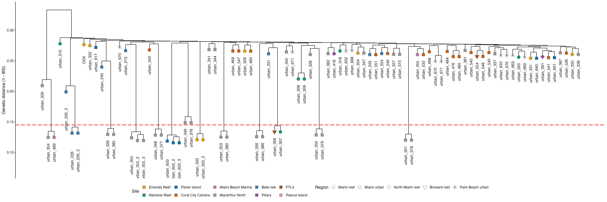
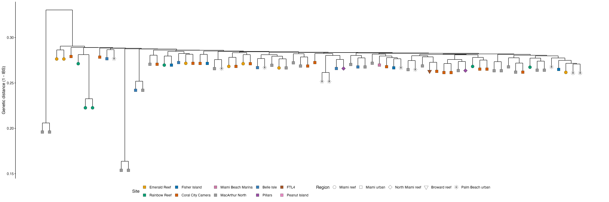

<a href="https://github.com/mstudiva/Urban-coral-population-genetics" class="github-corner" aria-label="View source on GitHub"><svg width="80" height="80" viewBox="0 0 250 250" style="fill:#2C3E50; color:#fff; position: absolute; top: 0; border: 0; right: 0;" aria-hidden="true"><path d="M0,0 L115,115 L130,115 L142,142 L250,250 L250,0 Z"></path><path d="M128.3,109.0 C113.8,99.7 119.0,89.6 119.0,89.6 C122.0,82.7 120.5,78.6 120.5,78.6 C119.2,72.0 123.4,76.3 123.4,76.3 C127.3,80.9 125.5,87.3 125.5,87.3 C122.9,97.6 130.6,101.9 134.4,103.2" fill="currentColor" style="transform-origin: 130px 106px;" class="octo-arm"></path><path d="M115.0,115.0 C114.9,115.1 118.7,116.5 119.8,115.4 L133.7,101.6 C136.9,99.2 139.9,98.4 142.2,98.6 C133.8,88.0 127.5,74.4 143.8,58.0 C148.5,53.4 154.0,51.2 159.7,51.0 C160.3,49.4 163.2,43.6 171.4,40.1 C171.4,40.1 176.1,42.5 178.8,56.2 C183.1,58.6 187.2,61.8 190.9,65.4 C194.5,69.0 197.7,73.2 200.1,77.6 C213.8,80.2 216.3,84.9 216.3,84.9 C212.7,93.1 206.9,96.0 205.4,96.6 C205.1,102.4 203.0,107.8 198.3,112.5 C181.9,128.9 168.3,122.5 157.7,114.1 C157.9,116.9 156.7,120.9 152.7,124.9 L141.0,136.5 C139.8,137.7 141.6,141.9 141.8,141.8 Z" fill="currentColor" class="octo-body"></path></svg></a>

```{=html}
<style>.github-corner:hover .octo-arm{animation:octocat-wave 560ms ease-in-out}@keyframes octocat-wave{0%,100%{transform:rotate(0)}20%,60%{transform:rotate(-25deg)}40%,80%{transform:rotate(10deg)}}@media (max-width:500px){.github-corner:hover .octo-arm{animation:none}.github-corner .octo-arm{animation:octocat-wave 560ms ease-in-out}}</style>
```
#### version: `r library(magrittr)` `r Sys.Date() %>% format(format="%d %B, %Y")`

#### [GitHub repository](https://github.com/mstudiva/Urban-coral-population-genetics){target="_blank"}

## A B O U T &nbsp; T H I S &nbsp; D O C U M E N T

This walkthrough describes the population genetics analysis of SNPs generated from *Diploria labyrinthiformis* samples collected across urbanized and reef habitats in southeast Florida. Sequence alignments are based on an existing genome assembly by the Aquatic Symbiosis Genomics Project: https://www.aquaticsymbiosisgenomics.org/. For initial processing of 2bRAD reads regardless of species, and the species-specific 2bRAD pipeline, please see below: 

- [2bRAD processing](https://mstudiva.github.io/Urban-coral-population-genetics/code/)
- [*Diploria labyrinthiformis*](https://mstudiva.github.io/Urban-coral-population-genetics/code/dlab)

Library prep, bioinformatics, and analysis protocols are credited to the 2bRAD pipeline originally developed by Misha Matz: https://doi.org/10.1038/nmeth.2023, and further refined by Ryan Eckert: https://ryaneckert.github.io/Stephanocoenia_FKNMS_PopGen/code/ 

<br>

#### All analyses preformed with R version `r getRversion()`.

<br>

***
## S E T U P 
***

```{r, setup, include = FALSE}
# setup rmarkdown environment first

knitr::opts_chunk$set(warning = FALSE, fig.align = 'left')
options(width = 88)

library(magrittr)

#setting working directory to the directory containing this .Rmd file
setwd(dirname(rstudioapi::getActiveDocumentContext()$path))
```

### Loading required packages

For the following analyses we will require the use of a number of different R packages. We can use the following code to quickly load in the packages and install any packages not previously installed in the R console.

```{r, load packages, include = TRUE, message = FALSE, warning = FALSE, results = 'hide'}
if (!require("pacman")) install.packages("pacman")

pacman::p_load_gh("pmartinezarbizu/pairwiseAdonis/pairwiseAdonis", "ropensci/rnaturalearthhires", "KarstensLab/microshades")

pacman::p_load("cowplot", "car", "ggrepel", "ggspatial", "paletteer", "patchwork", "rgdal", "rnaturalearth", "sf", "Hmisc", "MCMC.OTU", "pairwiseAdonis", "RColorBrewer", "Redmonder", "flextable", "lubridate", "officer", "adegenet", "dendextend", "gdata", "ggdendro", "hierfstat", "kableExtra", "poppr", "reshape2", "StAMPP", "vcfR", "vegan", "boa", "magick", "rgeos", "sdmpredictors", "ggcorrplot", "tidyverse", "TeachingDemos", "LaplacesDemon", "adespatial", "ggnewscale", "ggbeeswarm", "multcomp", "rstatix", "R.utils", "graph4lg")

options("scipen" = 10)
```

<br>

Making color palettes to use throughout all plots

<br>

***
## M A P &nbsp; O F &nbsp; S T U D Y &nbsp; S I T E S
***

<br>

***
## P O P U L A T I O N &nbsp; G E N E T I C S &nbsp; A N A L Y S E S 
***

Analyzing 2bRAD generated SNPs (20,323 loci) for population structure/genetic connectivity across urbanized and reef sites in southeast Florida

## Identifiying clonal multi-locus genotypes

### Dendrogram with clones

Identification of any natural clones using technical replicates as a baseline for clonality between samples

```{r, Dendrogram With Clones, fig.width=13, fig.height=4.75, dpi=150, out.width="100%"}
pacman::p_load("dendextend", "ggdendro", "tidyverse")

cloneBams = read.csv("../../data/dlab/dlabMetadata.csv") # list of bam files

cloneMa = as.matrix(read.table("../../data/dlab/ANGSD/clones/dlabClones.ibsMat")) # reads in IBS matrix produced by ANGSD 

dimnames(cloneMa) = list(cloneBams[,2],cloneBams[,2])
clonesHc = hclust(as.dist(cloneMa),"ave")

clonePops = cloneBams$region
cloneSite = cloneBams$site

cloneDend = cloneMa %>% as.dist() %>% hclust(.,"ave") %>% as.dendrogram()
cloneDData = cloneDend %>% dendro_data()

# Making the branches hang shorter so we can easily see clonal groups
cloneDData$segments$yend2 = cloneDData$segments$yend
for(i in 1:nrow(cloneDData$segments)) {
  if (cloneDData$segments$yend2[i] == 0) {
    cloneDData$segments$yend2[i] = (cloneDData$segments$y[i] - 0.01)}}

cloneDendPoints = cloneDData$labels
cloneDendPoints$region = clonePops[order.dendrogram(cloneDend)]
cloneDendPoints$site=cloneSite[order.dendrogram(cloneDend)]
rownames(cloneDendPoints) = cloneDendPoints$label

cloneDendPoints$region = as.factor(cloneDendPoints$region)
cloneDendPoints$site = as.factor(cloneDendPoints$site)

# Making points at the leaves to place symbols for regions
point = as.vector(NA)
for(i in 1:nrow(cloneDData$segments)) {
  if (cloneDData$segments$yend[i] == 0) {
    point[i] = cloneDData$segments$y[i] - 0.01
  } else {
    point[i] = NA}}

cloneDendPoints$y = point[!is.na(point)]

techReps = c("urban_226", "urban_226_2", "urban_226_3", "urban_333", "urban_333_2", "urban_355", "urban_355_2", "urban_355_3", "urban_650", "urban_650_2", "urban_650_3")
cloneDendPoints$site = factor(cloneDendPoints$site,levels(cloneDendPoints$site)[c(3, 10, 4, 2, 7, 6, 1, 9, 5, 8)])
cloneDendPoints$site

cloneDendPoints$region = factor(cloneDendPoints$region,levels(cloneDendPoints$region)[c(2, 3, 4, 1, 5)])
cloneDendPoints$region

Pal <- c("#E69F00","#009E73","#0072B2","#D55E00","#CC79A7","#999999","#377EB8","#984EA3","#A65628","#E78AC3","#B3B3B3")

cloneDendA = ggplot() +
  geom_segment(data = segment(cloneDData), aes(x = x, y = y, xend = xend, yend = yend2), size = 0.5) +
  geom_point(data = cloneDendPoints, aes(x = x, y = y, fill = site, shape = region), size = 4, stroke = 0.25) +
  scale_fill_manual(values = Pal, name= "Site")+
  scale_shape_manual(values = c(21, 22, 23, 25, 8), name = "Region")+
  geom_hline(yintercept = 0.145, color = "red", lty = 5, size = 0.75) + # creating a dashed line to indicate a clonal distance threshold
  geom_text(data = subset(cloneDendPoints, subset = label %in% techReps), aes(x = x, y = (y - .045), label = label), angle = 90) + # spacing technical replicates further from leaf
  geom_text(data = subset(cloneDendPoints, subset = !label %in% techReps), aes(x = x, y = (y - .025), label = label), angle = 90) +
  labs(y = "Genetic distance (1 - IBS)") +
  guides(fill = guide_legend(override.aes = list(shape = 22)))+
  theme_classic()

cloneDend = cloneDendA + theme(
  axis.title.x = element_blank(),
  axis.text.x = element_blank(),
  axis.line.x = element_blank(),
  axis.ticks.x = element_blank(),
  axis.title.y = element_text(size = 12, color = "black", angle = 90),
  axis.text.y = element_text(size = 10, color = "black"),
  axis.line.y = element_line(),
  axis.ticks.y = element_line(),
  panel.grid = element_blank(),
  panel.border = element_blank(),
  panel.background = element_rect(fill = "white", colour = NA),
  plot.background  = element_rect(fill = "white", colour = NA),
  legend.key = element_blank(),
  legend.title = element_text(size = 12),
  legend.text = element_text(size = 10),
  legend.position = "bottom")

cloneDend

ggsave("../../figures/dlab/cloneDend.pdf", plot = cloneDend, height = 8, width = 24, units = "in", dpi = 300)
ggsave("../../figures/dlab/cloneDend.png", plot = cloneDend, height = 8, width = 24, units = "in", dpi = 300)
```


<br>

### Dendrogram without clones
We removed the technical replicates/clones and re-ran ANGSD for all the following analyses

```{r, Dendrogram Without Clones, fig.width=13, fig.height=4.75, dpi=150, out.width="100%"}
pacman::p_load("dendextend", "ggdendro", "tidyverse")

bams = read.csv("../../data/dlab/dlabMetadata.csv")[-c(6, 7, 11, 26, 36, 39, 42, 44, 49, 50, 53, 54, 64, 81, 83),] # list of bams files and their populations (tech reps removed)

ma = as.matrix(read.table("../../data/dlab/ANGSD/dlabNoClones.ibsMat")) # reads in IBS matrix produced by ANGSD

dimnames(ma) = list(bams[,2],bams[,2])
Hc = hclust(as.dist(ma),"ave")

Pops = bams$region
Site = bams$site

Dend = ma %>% as.dist() %>% hclust(.,"ave") %>% as.dendrogram()
DData = Dend %>% dendro_data()

# Making the branches hang shorter so we can easily see clonal groups
DData$segments$yend2 = DData$segments$yend
for(i in 1:nrow(DData$segments)) {
  if (DData$segments$yend2[i] == 0) {
    DData$segments$yend2[i] = (DData$segments$y[i] - 0.01)}}

DendPoints = DData$labels
DendPoints$region = Pops[order.dendrogram(Dend)]
DendPoints$site=Site[order.dendrogram(Dend)]
rownames(DendPoints) = DendPoints$label

DendPoints$region = as.factor(DendPoints$region)
DendPoints$site = as.factor(DendPoints$site)

# Making points at the leaves to place symbols for regions
point = as.vector(NA)
for(i in 1:nrow(DData$segments)) {
  if (DData$segments$yend[i] == 0) {
    point[i] = DData$segments$y[i] - 0.01
  } else {
    point[i] = NA}}

DendPoints$y = point[!is.na(point)]

DendPoints$site = factor(DendPoints$site,levels(DendPoints$site)[c(3, 10, 4, 2, 7, 6, 1, 9, 5, 8)])

DendPoints$region = factor(DendPoints$region,levels(DendPoints$region)[c(2, 3, 4, 1, 5)])

Pal <- c("#E69F00","#009E73","#0072B2","#D55E00","#CC79A7","#999999","#377EB8","#984EA3","#A65628","#E78AC3","#B3B3B3")

DendA = ggplot() +
  geom_segment(data = segment(DData), aes(x = x, y = y, xend = xend, yend = yend2), size = 0.5) +
  geom_point(data = DendPoints, aes(x = x, y = y, fill = site, shape = region), size = 4, stroke = 0.25) +
  # scale_fill_brewer(palette = "Dark2", name = "Site") +
  scale_fill_manual(values = Pal, name= "Site")+
  scale_shape_manual(values = c(21, 22, 23, 25, 8), name = "Region")+
  labs(y = "Genetic distance (1 - IBS)") +
  guides(fill = guide_legend(override.aes = list(shape = 22)))+
  theme_classic()

Dend = DendA + theme(
  axis.title.x = element_blank(),
  axis.text.x = element_blank(),
  axis.line.x = element_blank(),
  axis.ticks.x = element_blank(),
  axis.title.y = element_text(size = 12, color = "black", angle = 90),
  axis.text.y = element_text(size = 10, color = "black"),
  axis.line.y = element_line(),
  axis.ticks.y = element_line(),
  panel.grid = element_blank(),
  panel.border = element_blank(),
  panel.background = element_rect(fill = "white", colour = NA),
  plot.background  = element_rect(fill = "white", colour = NA),
  legend.key = element_blank(),
  legend.title = element_text(size = 12),
  legend.text = element_text(size = 10),
  legend.position = "bottom")

Dend

ggsave("../../figures/dlab/Dend.pdf", plot = Dend, height = 8, width = 24, units = "in", dpi = 300)
ggsave("../../figures/dlab/Dend.png", plot = Dend, height = 8, width = 24, units = "in", dpi = 300)
```
