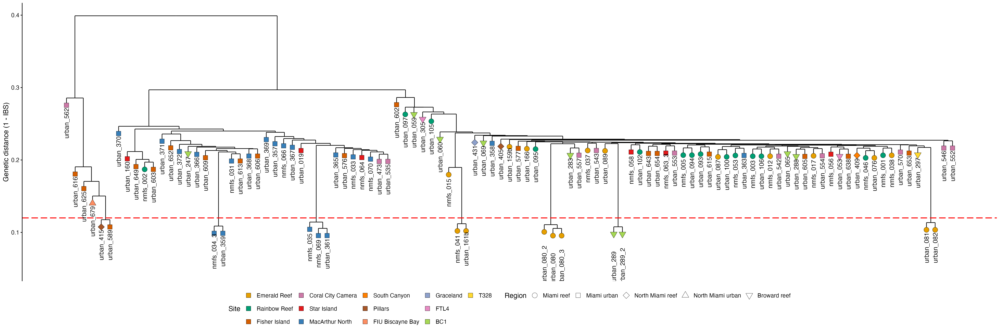

```{r setup, include=FALSE}
knitr::opts_chunk$set(echo = TRUE, eval = FALSE)
```

<a href="https://github.com/mstudiva/Urban-coral-population-genetics" class="github-corner" aria-label="View source on GitHub"><svg width="80" height="80" viewBox="0 0 250 250" style="fill:#2C3E50; color:#fff; position: absolute; top: 0; border: 0; right: 0;" aria-hidden="true"><path d="M0,0 L115,115 L130,115 L142,142 L250,250 L250,0 Z"></path><path d="M128.3,109.0 C113.8,99.7 119.0,89.6 119.0,89.6 C122.0,82.7 120.5,78.6 120.5,78.6 C119.2,72.0 123.4,76.3 123.4,76.3 C127.3,80.9 125.5,87.3 125.5,87.3 C122.9,97.6 130.6,101.9 134.4,103.2" fill="currentColor" style="transform-origin: 130px 106px;" class="octo-arm"></path><path d="M115.0,115.0 C114.9,115.1 118.7,116.5 119.8,115.4 L133.7,101.6 C136.9,99.2 139.9,98.4 142.2,98.6 C133.8,88.0 127.5,74.4 143.8,58.0 C148.5,53.4 154.0,51.2 159.7,51.0 C160.3,49.4 163.2,43.6 171.4,40.1 C171.4,40.1 176.1,42.5 178.8,56.2 C183.1,58.6 187.2,61.8 190.9,65.4 C194.5,69.0 197.7,73.2 200.1,77.6 C213.8,80.2 216.3,84.9 216.3,84.9 C212.7,93.1 206.9,96.0 205.4,96.6 C205.1,102.4 203.0,107.8 198.3,112.5 C181.9,128.9 168.3,122.5 157.7,114.1 C157.9,116.9 156.7,120.9 152.7,124.9 L141.0,136.5 C139.8,137.7 141.6,141.9 141.8,141.8 Z" fill="currentColor" class="octo-body"></path></svg></a>

```{=html}
<style>.github-corner:hover .octo-arm{animation:octocat-wave 560ms ease-in-out}@keyframes octocat-wave{0%,100%{transform:rotate(0)}20%,60%{transform:rotate(-25deg)}40%,80%{transform:rotate(10deg)}}@media (max-width:500px){.github-corner:hover .octo-arm{animation:none}.github-corner .octo-arm{animation:octocat-wave 560ms ease-in-out}}</style>
```

#### version: `r library(magrittr)` `r Sys.Date() %>% format(format="%d %B, %Y")`

#### [GitHub repository](https://github.com/mstudiva/Urban-coral-population-genetics){target="_blank"}

## A B O U T &nbsp; T H I S &nbsp; D O C U M E N T

This walkthrough describes the downstream processing and analysis of 2bRAD reads generated from *Orbicella faveolata* samples collected across urbanized and reef habitats in southeast Florida. Sequence alignments are based on an existing genome assembly by Young and colleagues: https://doi.org/10.1186/s12864-024-10092-w. For initial processing of 2bRAD reads regardless of species, please see below: 

- [2bRAD processing](https://mstudiva.github.io/Urban-coral-population-genetics/code/)

Library prep, bioinformatics, and analysis protocols are credited to the 2bRAD pipeline originally developed by Misha Matz: https://doi.org/10.1038/nmeth.2023, and further refined by Ryan Eckert: https://ryaneckert.github.io/Stephanocoenia_FKNMS_PopGen/code/ 

<br>

***
## M A P P I N G &nbsp; T O &nbsp; R E F E R E N C E
***

### Formatting genome assembly with Bowtie2
```{bash, db}
mkdir ~/db/symGenomes
cd ~/db/symGenomes
```

Using Symbiodiniaceae references from NCBI's most recent genomes:
Symbiodinium (NCBI GCA_965279495.1), Breviolum (GCA_965643015.1), Cladocopium (GCA_947184155.2), Durusdinium (GCA_963970005.1)

```{bash, concat sym}
python concatFasta.py -o symbConcatGenome.fasta -s symbConcatGenome_summary.tsv -m symbConcatGenome_contig_to_fakechr.tsv GCA_965279495.1_pySymTrid1.1_genomic.fna GCA_965643015.1_pyBreMinu3.1_genomic.fna GCA_947184155.2_Cgoreaui_SCF055-01_v2.1_genomic.fna GCA_963970005.1_Durusdinium_trenchii_CCMP2556_genomic.fna
```

Building bowtie2 index for concatenated symbiont genomes
```{bash, bowtie build}
conda activate 2bRAD
echo '#!/bin/bash' >genomeBuild.sh
echo bowtie2-build symbConcatGenome.fasta symbConcatGenome >>genomeBuild.sh
echo samtools faidx symbConcatGenome.fasta >>genomeBuild.sh
sbatch -o genomeBuild.o%j -e genomeBuild.e%j --mail-type=ALL --mail-user=studivanms@gmail.com genomeBuild.sh
```

Building bowtie2 index for *O. faveolata* genome
```{bash, bowtie build 2}
conda activate 2bRAD
echo '#!/bin/bash' >genomeBuild.sh
echo bowtie2-build Orbicella_faveolata_gen_17.scaffolds.fa OfaveolataGenome >>genomeBuild.sh
echo samtools faidx Orbicella_faveolata_gen_17.scaffolds.fa >>genomeBuild.sh
sbatch -o genomeBuild.o%j -e genomeBuild.e%j --mail-type=ALL --mail-user=studivanms@gmail.com genomeBuild.sh
```

<br>

### Aligning reads to concatenated symbiont genomes
```{bash, bowtie align}
conda activate 2bRAD
SYMGENOME=~/db/symGenomes/symbConcatGenome
2bRAD_bowtie2_launcher.py -g $SYMGENOME -f trim -n zooxMaps --split -u un -a zoox --launcher -e studivanms@gmail.com
sbatch zooxMaps.slurm

mkdir ../mappedReads
mkdir ../mappedReads/symbionts
mv *.sam ../mappedReads/symbionts
mv *.zoox ../mappedReads/symbionts
cd ../mappedReads/symbionts
```

Do we have the correct number of files?
```{bash, check count 3}
ll *.zoox | wc -l
```

Counting the mapped symbiont reads
```{bash, countmapped}
echo '#!/bin/bash' >mappedZooxReads
echo readCounts.sh -e zoox -o Zoox >>mappedZooxReads
sbatch --mem=200GB --mail-type=ALL --mail-user=studivanms@gmail.com mappedZooxReads
```
scp ZooxReadCounts to local machine

<br>

Making script to generate indexed bam files
```{bash, sam2bam}
>s2b
for file in *.sam; do
echo "samtools sort -O bam -o ${file/.sam/}.bam $file && samtools index ${file/.sam/}.bam">>s2b;
done
launcher_creator.py -j s2b -n s2b -t 6:00:00 -N 5 -e studivanms@gmail.com -q shortq7
sbatch s2b.slurm
```

Counting the symbiont reads by genera
```{bash, zooxcounts}
>ZooxReads
for i in *.bam; do
echo $i >>ZooxReads;
samtools idxstats $i | cut -f 1,3 >>ZooxReads;
done
```
scp ZooxReads to local machine

<br>

Housekeeping for long-term storage
```{bash, housekeeping 2}
zipper.py -a -9 -f sam --launcher -e studivanms@gmail.com
sbatch zip.slurm

zipper.py -a -9 -f zoox --launcher -e studivanms@gmail.com
sbatch zip.slurm
```

<br>

### Aligning remaining reads to coral genome
```{bash, bowtie align 2}
cd ~/urban/ofav/filteredReads
conda activate 2bRAD
HOSTGENOME=~/db/ofavGenome/OfaveolataGenome
mkdir junk
# mapping with --local option, enables clipping of mismatching ends (guards against deletions near ends of RAD tags)
2bRAD_bowtie2_launcher.py -g $HOSTGENOME -f un --split -u junk -a host --undir junk --launcher -e studivanms@gmail.com
sbatch --mem=200GB maps.slurm
```

Do we have the correct number of files?
```{bash, check count 4}
ll *.sam | wc -l
```

Counting the mapped coral reads
```{bash, countmapped 2}
echo '#!/bin/bash' >mappedReads
echo readCounts.sh -e host -o Host >>mappedReads
sbatch --mem=200GB --mail-type=ALL --mail-user=studivanms@gmail.com mappedReads
```
scp HostReadCounts to local machine

<br>

Making script to generate indexed bam files
```{bash, sam2bam 2}
>s2b
for file in *.sam; do
echo "samtools sort -O bam -o ${file/.sam/}.bam $file && samtools index ${file/.sam/}.bam">>s2b;
done

launcher_creator.py -j s2b -n s2b -q shortq7 -t 06:00:00 -e studivanms@gmail.com
sbatch --mem=200GB s2b.slurm

ll *bam | wc -l
```

Housekeeping for long-term storage
```{bash, housekeeping 3}
zipper.py -a -9 -f sam --launcher -e studivanms@gmail.com
sbatch zip.slurm

zipper.py -a -9 -f un --launcher -e studivanms@gmail.com
sbatch zip.slurm

zipper.py -a -9 -f trim --launcher -e studivanms@gmail.com
sbatch zip.slurm

zipper.py -a -9 -f host --launcher -e studivanms@gmail.com
sbatch zip.slurm

mv *.trim.gz ../../trimmedReads
mv *.sam.gz ../mappedReads
mv *.host.gz ../mappedReads
mv *.bam ../mappedReads
mv *.bai ../mappedReads

cd junk
zipper.py -a -9 -f junk --launcher -e studivanms@gmail.com
sbatch zip.slurm
```

<br>

***
## G E N O T Y P I N G 
***

### Genotyping with ANGSD 
Doesn't call actual genotypes, but instead generates genotype likelihoods at each SNP. Optimal for low-coverage data (<10x) like 2bRAD.

Copy all *.bam* files to a new directory 'ANGSD'
```{bash, bams}
mkdir ../ANGSD
cd ../ANGSD
mv ../mappedReads/*.bam* .

ls *bam >bamsClones
```

Assessing base qualities and coverage depth
```-minMapQ 20```: only highly unique mappings (prob of erroneous mapping =< 1%)
```-baq 1```: realign around indels (not terribly relevant for 2bRAD reads mapped with --local option)
```-maxDepth```: highest total depth (sum over all samples) to assess; set to 10x number of samples
```-minInd```: the minimal number of individuals the site must be genotyped in. Set to 50% of total N at this stage.
```{bash, ANGSD}
export FILTERS="-uniqueOnly 1 -remove_bads 1 -minMapQ 20 -maxDepth 1030 -minInd 52"
export TODO="-doQsDist 1 -doDepth 1 -doCounts 1 -dumpCounts 2"

echo '#!/bin/bash' >ofavDD.sh
echo angsd -b bamsClones -GL 1 $FILTERS $TODO -P 1 -out dd -nThreads 20 >>ofavDD.sh

sbatch --mem=200GB -o ofavDD.o%j -e ofavDD.e%j --mail-user=studivanms@gmail.com --mail-type=ALL --partition=shortq7 ofavDD.sh
```

Summarizing results
```{bash, ANGSD results}
module load R/3.6.1
echo '#!/bin/bash' >RQC.sh
echo Rscript ~/bin/plotQC.R prefix=dd >>RQC.sh
echo gzip -9 dd.counts >>RQC.sh
sbatch -e RQC.e%j -o RQC.o%j --dependency=afterok:460550 --mem=200GB --mail-type=ALL --mail-user=studivanms@gmail.com RQC.sh
```

Proportion of sites covered at >5X:
```{bash, }
cat quality.txt
```
scp dd.pdf to local machine to look at distribution of base quality scores, fraction of sites in each sample passing coverage thresholds and fraction of sites passing genotyping rates cutoffs. Use these to guide choices of ```-minQ```,  ```-minIndDepth``` and ```-minInd``` filters in subsequent ```ANGSD``` runs.  


<br>

### Identifying clones and technical replicates
Set the ```-minInd``` flag to 75% of the number of samples you have
```{bash, ANGSD 2}
FILTERS="-uniqueOnly 1 -remove_bads 1 -minMapQ 20 -minQ 30 -dosnpstat 1 -doHWE 1 -hwe_pval 1e-5 -sb_pval 1e-5 -hetbias_pval 1e-5 -skipTriallelic 1 -minInd 77 -snp_pval 1e-6 -minMaf 0.05"
TODO="-doMajorMinor 1 -doMaf 1 -doCounts 1 -makeMatrix 1 -doIBS 1 -doCov 1 -doGeno 8 -doBcf 1 -doPost 1 -doGlf 2"

echo '#!/bin/bash' > ofavClones.sh
echo angsd -b bamsClones -GL 1 $FILTERS $TODO -P 1 -out ofavClones >>ofavClones.sh

sbatch --mem=200GB -o radClones.o%j -e radClones.e%j --mail-type=ALL --mail-user=studivanms@gmail.com --partition=shortq7 radClones.sh
```

<br>

scp .ibsMat and .bcf files to local machine
Use ibs matrix to identify clones with hierachial clustering in ```R```. ```scp``` to local machine and run chunk below in ```R```

```{r, Dendrogram With Clones, fig.width=13, fig.height=4.75, dpi=150, out.width="100%"}
pacman::p_load("dendextend", "ggdendro", "tidyverse")

cloneBams = read.csv("../../data/ofav/ofavMetadata.csv") # list of bam files

cloneMa = as.matrix(read.table("../../data/ofav/ANGSD/clones/ofavClones.ibsMat")) # reads in IBS matrix produced by ANGSD 

dimnames(cloneMa) = list(cloneBams[,2],cloneBams[,2])
clonesHc = hclust(as.dist(cloneMa),"ave")

clonePops = cloneBams$region
cloneSite = cloneBams$site

cloneDend = cloneMa %>% as.dist() %>% hclust(.,"ave") %>% as.dendrogram()
cloneDData = cloneDend %>% dendro_data()

# Making the branches hang shorter so we can easily see clonal groups
cloneDData$segments$yend2 = cloneDData$segments$yend
for(i in 1:nrow(cloneDData$segments)) {
  if (cloneDData$segments$yend2[i] == 0) {
    cloneDData$segments$yend2[i] = (cloneDData$segments$y[i] - 0.01)}}

cloneDendPoints = cloneDData$labels
cloneDendPoints$region = clonePops[order.dendrogram(cloneDend)]
cloneDendPoints$site=cloneSite[order.dendrogram(cloneDend)]
rownames(cloneDendPoints) = cloneDendPoints$label

cloneDendPoints$region = as.factor(cloneDendPoints$region)
cloneDendPoints$site = as.factor(cloneDendPoints$site)

# Making points at the leaves to place symbols for regions
point = as.vector(NA)
for(i in 1:nrow(cloneDData$segments)) {
  if (cloneDData$segments$yend[i] == 0) {
    point[i] = cloneDData$segments$y[i] - 0.01
  } else {
    point[i] = NA}}

cloneDendPoints$y = point[!is.na(point)]

techReps = c("urban_080", "urban_080_2", "urban_080_3", "urban_289", "urban_289_2")
cloneDendPoints$site = factor(cloneDendPoints$site,levels(cloneDendPoints$site)[c(3, 10, 4, 2, 12, 8, 11, 9, 5, 7, 6, 1, 13)])

cloneDendPoints$region = factor(cloneDendPoints$region,levels(cloneDendPoints$region)[c(2, 3, 4, 5, 1)])

Pal <- c("#E69F00","#009E73","#D55E00","#CC79A7","#E41A1C","#377EB8","#FF7F00","#A65628","#FC8D62","#8DA0CB","#E78AC3","#A6D854","#FFD92F")

cloneDendA = ggplot() +
  geom_segment(data = segment(cloneDData), aes(x = x, y = y, xend = xend, yend = yend2), size = 0.5) +
  geom_point(data = cloneDendPoints, aes(x = x, y = y, fill = site, shape = region), size = 4, stroke = 0.25) +
  # scale_fill_brewer(palette = "Dark2", name = "Site") +
  scale_fill_manual(values = Pal, name= "Site")+
  scale_shape_manual(values = c(21, 22, 23, 24, 25), name = "Region")+
  geom_hline(yintercept = 0.12, color = "red", lty = 5, size = 0.75) + # creating a dashed line to indicate a clonal distance threshold
  geom_text(data = subset(cloneDendPoints, subset = label %in% techReps), aes(x = x, y = (y - .045), label = label), angle = 90) + # spacing technical replicates further from leaf
  geom_text(data = subset(cloneDendPoints, subset = !label %in% techReps), aes(x = x, y = (y - .025), label = label), angle = 90) +
  labs(y = "Genetic distance (1 - IBS)") +
  guides(fill = guide_legend(override.aes = list(shape = 22)))+
  theme_classic()

cloneDend = cloneDendA + theme(
  axis.title.x = element_blank(),
  axis.text.x = element_blank(),
  axis.line.x = element_blank(),
  axis.ticks.x = element_blank(),
  axis.title.y = element_text(size = 12, color = "black", angle = 90),
  axis.text.y = element_text(size = 10, color = "black"),
  axis.line.y = element_line(),
  axis.ticks.y = element_line(),
  panel.grid = element_blank(),
  panel.border = element_blank(),
  panel.background = element_rect(fill = "white", colour = NA),
  plot.background  = element_rect(fill = "white", colour = NA),
  legend.key = element_blank(),
  legend.title = element_text(size = 12),
  legend.text = element_text(size = 10),
  legend.position = "bottom")

cloneDend

ggsave("../../figures/ofav/cloneDend.pdf", plot = cloneDend, height = 8, width = 24, units = "in", dpi = 300)
ggsave("../../figures/ofav/cloneDend.png", plot = cloneDend, height = 8, width = 24, units = "in", dpi = 300)
```

<br>

### Removing clones and re-running ANGSD
Set the ```-minInd``` flag to 75% of the number of samples you have remaining after removal of clones
```{bash, ANGSD no clones}
mkdir clones
mv ofavClones* clones

ll *.bam > bamsNoClones

cat bamsClones | grep -v 'OFAV_urban_359.trim.un.bt2.bam\|OFAV_nmfs_035.trim.un.bt2.bam\|OFAV_nmfs_069.trim.un.bt2.bam\|OFAV_nmfs_041.trim.un.bt2.bam\|OFAV_urban_080_2.trim.un.bt2.bam\|OFAV_urban_080_3.trim.un.bt2.bam\|OFAV_urban_289_2.trim.un.bt2.bam\|OFAV_urban_081.trim.un.bt2.bam\|OFAV_urban_415.trim.un.bt2.bam' >bamsNoClones

module load angsd-0.933-gcc-9.2.0-65d64pp
FILTERS="-uniqueOnly 1 -remove_bads 1 -minMapQ 20 -minQ 30 -dosnpstat 1 -doHWE 1 -hwe_pval 1e-5 -sb_pval 1e-5 -hetbias_pval 1e-5 -skipTriallelic 1 -minInd 70 -snp_pval 1e-6 -minMaf 0.05"
TODO="-doMajorMinor 1 -doMaf 1 -doCounts 1 -makeMatrix 1 -doIBS 1 -doCov 1 -doGeno 8 -doBcf 1 -doPost 1 -doGlf 2"

echo '#!/bin/bash' > ofavNoClones.sh
echo angsd -b bamsNoClones -GL 1 $FILTERS $TODO -P 1 -out ofavNoClones >> ofavNoClones.sh
sbatch --mem=200GB -o radNoClones.o%j -e radNoClones.e%j -p shortq7 --mail-type=ALL --mail-user=studivanms@gmail.com radNoClones.sh
```

How many SNPs do we have?
```{bash, SNPs? 1}
grep "filtering:" ofavNoClones.e*
```
Number of sites retained after filtering: 20323 

<br>

Some housekeeping
```{bash, housekeeping 4}
zipper.py -a -9 -f bam --launcher -e studivanms@gmail.com
sbatch zip.slurm
```

<br>

***
## P O P U L A T I O N &nbsp; S T R U C T U R E
***

### Resolving population structure with pcangsd
```{bash, pcangsd}
mkdir ../pcangsd
cd pcangsd

cp ../ANGSD/ofavNoClones.beagle.gz .

conda activate pcangsd

echo '#!/bin/bash' > pcangsd.sh
echo 'pcangsd -b ofavNoClones.beagle.gz -o ofavPcangsd --admix --inbreed-samples --pcadapt --selection' >> pcangsd
launcher_creator.py -j pcangsd -n pcangsd -q shortq7 -t 06:00:00 -e $EMAIL -w 1 -N 1
sbatch pcangsd.slurm
```

Calculating population structure from genotype likelihoods using NGSadmix (part of ANGSD)
Simulating (50x) different values of K (minimum of 1, maximum of the number of your sites + 3)
```{bash, ngsadmix}
mkdir ../ngsAdmix
cp *beagle* ../ngsAdmix
cd ../ngsAdmix

ngsAdmixLauncher.py -f ofavNoClones.beagle.gz --maxK 16 -r 50 -n ofav --launcher -e studivanms@gmail.com
sbatch --mem=200GB ofavNgsAdmix.slurm
```

<br>

### Determining the most likely number of ancestral populations (K)
Taking the likelihood value from each run of NGSadmix and put them into a file that can be used with Clumpak to calculate the most likely K using the methods of Evanno et al. (2005).
```{bash, clumpak}
>ofavNgsAdmixLogfile
for log in ofav*.log; do
grep -Po 'like=\K[^ ]+' $log >> ofavNgsAdmixLogfile;
done
```

Start R in command line
```{bash, R}
R

logs <- as.data.frame(read.table("ofavNgsAdmixLogfile"))

# output is organized with 10, 11 preceding 1, 2, 3 etc.
logs$K <- c(rep("10", 50), rep("11", 50), rep("12", 50), rep("13", 50), rep("14", 50), rep("15", 50), rep("16", 50), rep("1", 50), rep("2", 50), rep("3", 50), rep("4", 50), rep("5", 50), rep("6", 50), rep("7", 50), rep("8", 50), rep("9", 50))
write.table(logs[, c(2, 1)], "ofavNgsAdmixLogfile_formatted", row.names = F, col.names = F, quote = F)
quit()
# No need to save workspace image [press 'n']
n
```

Check that the formatted log file has the correct number of entries
```{bash, check rows}
cat ofavNgsAdmixLogfile_formatted | wc -l
```
800, so yes (K=16 * 50 simulations each)

<br>

Make copies of .qopt files to run structure selector on (.Q files)
```{bash, qloop}
for file in ofav*.qopt; do
filename=$(basename -- "$file" .qopt);
cp "$file" "$filename".Q;
done

mkdir ofavQ
mv ofav*Q ofavQ

zip -r ofavQ.zip ofavQ
```
scp .zip, formatted logfile, and ofavNoClones* to local machine

Create a PopMap file from bamsNoClones: a two-column, tab-delimited text file with sampleID and populationID
Reorder output Q files and PopMap file based on specific site order 
```{r, qsort}
library(tidyverse)

popfile <- read.table(file = "../../data/ofav/ngsAdmix/ofavPopfile.txt", header = FALSE, col.names=c("sample", "site"), stringsAsFactors=FALSE)

site_order <- c(
  "EmeraldReef",
  "RainbowReef",
  "FisherIsland",
  "CoralCityCamera",
  "StarIsland",
  "MacArthurNorth",
  "SouthCanyonReef",
  "PillarsReef",
  "FIUBiscayneBay",
  "GracelandReef",
  "FTL4Reef",
  "BC1Reef",
  "T328Reef"
)

site_factor <- factor(popfile$site, levels = site_order)
ord <- order(site_factor)

popfile_sorted <- popfile[ord, ]

write.table(popfile_sorted, "../../data/ofav/ngsAdmix/ofavPopfile_sorted.txt",
            quote=FALSE, row.names=FALSE, col.names=FALSE, sep="\t")

# Unzips, loops through, and reorders each .Q file based on popfile_sorted
unzip("../../data/ofav/ngsAdmix/ofavQ.zip", exdir = "../../data/ofav/ngsAdmix/")

q_dir  <- "../../data/ofav/ngsAdmix/ofavQ"              # where .Q files now live
out_dir <- "../../data/ofav/ngsAdmix/ofavQ_sorted"   # new folder for reordered files
dir.create(out_dir, showWarnings = FALSE)

q_files <- list.files(q_dir, pattern="\\.Q$|\\.qopt$", full.names=TRUE)
length(q_files) # should be 800

for (file in q_files) {

  q <- read.table(file, header=FALSE, colClasses = "character")

  # must have same number of rows
  stopifnot(nrow(q) == nrow(popfile_sorted))

  q_sorted <- q[ord, ]

  out_file <- file.path(out_dir, basename(file))

  write.table(
    q_sorted,
    out_file,
    quote = FALSE,
    row.names = FALSE,
    col.names = FALSE
  )
}

# Cleanup
unlink(q_dir, recursive = TRUE) # Delete the uncompressed ofavQ directory 

# Zip the ofavQ_sorted directory
out_dir_norm <- normalizePath(out_dir)
parent_dir   <- dirname(out_dir_norm)
folder_name  <- basename(out_dir_norm)

zipfile_path <- file.path(parent_dir, "ofavQ_sorted.zip")
cmd <- sprintf(
  'cd "%s" && zip -r "%s" "%s"',
  parent_dir,
  basename(zipfile_path),
  folder_name
)
cat("Running command:\n", cmd, "\n")
system(cmd)
if (file.exists(zipfile_path)) {
  unlink(out_dir_norm, recursive = TRUE)
} # Delete the uncompressed ofavQ_sorted directory 
```
Upload logfile to CLUMPAK as a Log Probability table file (http://clumpak.tau.ac.il/bestK.html)
And .zip to structure selector as an ADMIXTURE file (https://lmme.qdio.ac.cn/stable/StructureSelector/index.html)

<br>

### Optional: K determination in likely panmictic populations (K=1)
If Clumpak fails due to all simulations of K=1 having zero standard deviation (all models having the same log likelihood), your populations may be acting as a single unit (panmixia)
We can run the Evanno method another way to determine if K=1 is the most likely scenario, and can evaluate potential cryptic genetic lineages

```{r, K determination, fig.width=4, fig.height=6, dpi=150}
# Load libraries
library(ggplot2)
library(dplyr)
library(patchwork)

# -------------------------
# 1. Read space-delimited input file
# -------------------------
data_file <- "../../data/ofav/ngsAdmix/ofavNgsAdmixLogfile_formatted"  # replace with your file
df <- read.table(data_file, header = FALSE, sep = "", 
                 col.names = c("K", "LogLikelihood"), stringsAsFactors = FALSE)

# -------------------------
# 2. Clean columns and convert to numeric
# -------------------------
df$K <- as.numeric(trimws(df$K))
df$LogLikelihood <- as.numeric(trimws(df$LogLikelihood))
df <- df[!is.na(df$K) & !is.na(df$LogLikelihood), ]

if(nrow(df) == 0) stop("No valid data found in the file. Check file formatting.")

# -------------------------
# 3. Summarize mean and SD for each K
# -------------------------
summary_df <- df %>%
  group_by(K) %>%
  summarise(MeanLnP = mean(LogLikelihood, na.rm = TRUE),
            SD = sd(LogLikelihood, na.rm = TRUE)) %>%
  arrange(K)

# -------------------------
# 4. Calculate ΔK robustly
# -------------------------
L <- summary_df$MeanLnP
n <- nrow(summary_df)
deltaK <- rep(NA, n)

if(n >= 3) {
  for(i in 2:(n-1)) {
    Li_minus1 <- L[i-1]; Li <- L[i]; Li_plus1 <- L[i+1]; SDi <- summary_df$SD[i]
    if(all(is.finite(c(Li_minus1, Li, Li_plus1, SDi))) && SDi != 0) {
      deltaK[i] <- abs(Li_plus1 - 2*Li + Li_minus1) / SDi
    }
  }
}

summary_df$deltaK <- deltaK

# -------------------------
# 5. Identify all ΔK peaks
# -------------------------
is_peak <- rep(FALSE, n)
if(n >= 3 && any(!is.na(deltaK))) {
  for(i in 2:(n-1)) {
    if(!is.na(deltaK[i])) {
      left <- deltaK[i-1]; right <- deltaK[i+1]
      if((is.na(left) || deltaK[i] > left) && (is.na(right) || deltaK[i] > right)) {
        is_peak[i] <- TRUE
      }
    }
  }
}
peaks_df <- summary_df[is_peak, ]

# Identify global best K (largest ΔK)
global_best <- if(nrow(peaks_df) > 0) peaks_df[which.max(peaks_df$deltaK), ] else NULL

# -------------------------
# 6. Create plots
# -------------------------

# ΔK plot
if(!all(is.na(summary_df$deltaK))) {
  p_deltaK <- ggplot(summary_df, aes(x = K, y = deltaK)) +
    geom_line(color = "steelblue") +
    geom_point() +
    theme_minimal() +
    labs(title = "ΔK Plot (Evanno Method)",
         x = "K",
         y = expression(Delta*K)) +
    coord_cartesian(clip = "off")  # prevent label clipping
  
  if(nrow(peaks_df) > 0) {
    p_deltaK <- p_deltaK +
      geom_point(data = peaks_df, aes(x = K, y = deltaK), color = "red", size = 3) +
      geom_text(data = peaks_df, aes(x = K, y = deltaK, label = paste("K =", K)),
                vjust = -0.5, color = "red", fontface = "bold", clip = "off")
  }
  
  if(!is.null(global_best)) {
    p_deltaK <- p_deltaK +
      geom_point(data = global_best, aes(x = K, y = deltaK), color = "darkred", size = 5) +
      geom_text(data = global_best, aes(x = K, y = deltaK, label = paste("Best K =", K)),
                vjust = -1, color = "darkred", fontface = "bold", clip = "off")
  }
} else {
  p_deltaK <- NULL
}

# Mean LogLikelihood plot
p_mean <- ggplot(summary_df, aes(x = K, y = MeanLnP)) +
  geom_line(color = "darkgreen") +
  geom_point(size = 3) +
  theme_minimal() +
  labs(title = "Mean Log Likelihood vs K",
       x = "K",
       y = "Mean Log Likelihood") +
  coord_cartesian(clip = "off")

# Combine plots vertically
if(!is.null(p_deltaK)) {
  p_combined <- p_deltaK / p_mean + plot_layout(heights = c(1,1))
} else {
  p_combined <- p_mean
}

# -------------------------
# 7. Save combined plot
# -------------------------
output_file <- "../../figures/ofav/DeltaK_and_MeanLnP_plot.png"
ggsave(output_file, plot = p_combined, width = 6, height = 8, dpi = 300)

# -------------------------
# 8. Print peak info
# -------------------------
cat("Plot saved as", output_file, "\n")
if(!is.null(global_best)) {
  cat("ΔK peaks at K =", paste(peaks_df$K, collapse = ", "), "\n")
  cat("ΔK values:", paste(round(peaks_df$deltaK, 2), collapse = ", "), "\n")
  cat("Global best K =", global_best$K, "with ΔK =", round(global_best$deltaK, 2), "\n")
} else if(nrow(summary_df) > 0) {
  cat("ΔK could not be calculated; showing Mean Log Likelihood plot.\n")
} else {
  cat("No valid data to plot.\n")
}
```


<br>

While K=1 (panmixia) appears to be the most likely scenario based on model likelihoods, the Evanno method suggests K=3, so there may be cryptic lineages

<br>

K=1

K=2

K=3


K=4


<br>

### Re-running ANGSD within lineages
Since there are three possible cryptic lineages, we need to re-genotype samples using ANGSD using only SNPs found across all lineages. This helps avoid issues of ascertainment bias.

```{bash, angsd lineage}
cd ~/urban/ofav/ANGSD

# created 'bamsClusters' in ofavR.Rmd based on Admixture analysis
awk 'BEGIN { FS=" " } $2 == "Blue" { print $1 }' bamsClusters >> blueBams
awk 'BEGIN { FS=" " } $2 == "Orange" { print $1 }' bamsClusters >> orangeBams
awk 'BEGIN { FS=" " } $2 == "Purple" { print $1 }' bamsClusters >> purpleBams

FILTERS="-uniqueOnly 1 -remove_bads 1 -minMapQ 20 -minQ 30 -dosnpstat 1 -doHWE 1 -hwe_pval 1e-5 -sb_pval 1e-5 -hetbias_pval 1e-5 -skipTriallelic 1 -snp_pval 1e-5 -minMaf 0.05 -setMinDepthInd 3"
TODO="-doMajorMinor 1 -doMaf 1 -doGeno 8 -doPost 1 -doGlf 2"

# Remember to set -minInd to 75% of the sample size for each cluster
echo "angsd -b blueBams -GL 1 -P 1 $FILTERS $TODO -minInd 40 -out ofavBlueSnps
angsd -b orangeBams -GL 1 -P 1 $FILTERS $TODO -minInd 21 -out ofavOrangeSnps
angsd -b purpleBams -GL 1 -P 1 $FILTERS $TODO -minInd 3 -out ofavPurpleSnps" > kSnps

launcher_creator.py -j kSnps -n kSnps -q shortq7 -t 06:00:00 -e $EMAIL -w 2 -N 1
sbatch kSnps.slurm
```

<br>

Filtering down the sites to those found within each lineage with the given ANGSD filtering criteria
```{bash, angsd lineage2}
for file in ofav*Snps.geno.gz; do
echo '#!/bin/bash' > ${file%%.*}.sh;
echo "zcat $file | awk '{print \$1\"\t\"\$2}' > ${file%%.*}sites" >> ${file%%.*}.sh;
sbatch -e ${file%%.*}.e%j -o ${file%%.*}.o%j -p shortq7 --mem=100GB --mail-user $EMAIL --mail-type=ALL ${file%%.*}.sh;
done

# For gattaca:
for file in ofav*Snps.geno.gz; do
    base="${file%%.*}"
    echo "Processing $file → ${base}sites"
    zcat "$file" | awk '{print $1"\t"$2}' > "${base}sites"
done

# The Purple lineage has so few samples and high divergence to the other clusters, so filtering to SNPs found across all results in 20 sites
# Dropping Purple from this filtering step
mv ofavPurpleSnpssites ../ofavPurpleSnpssites
srun awk '(++c[$0])==(ARGC-1)' *Snpssites > sitesToDo
# 6528

mkdir ../filteredSNPS
mv ofav*Snps* ../filteredSNPS/
mv kSnps* ../filteredSNPS/
```

<br>

Now index the sites file and run angsd on all samples with only the reduced number of sites using ```-sites``` flag

```{bash, angsd lineage3}
angsd sites index sitesToDo

FILTERS="-uniqueOnly 1 -remove_bads 1 -minMapQ 20 -minQ 30 -dosnpstat 1 -doHWE 1 -hwe_pval 1e-5 -sb_pval 1e-5 -hetbias_pval 1e-5 -skipTriallelic 1 -snp_pval 1e-5 -minMaf 0.05 -setMinDepthInd 3"

TODO="-doMajorMinor 1 -doMaf 1 -doCounts 1 -makeMatrix 1 -doIBS 1 -doCov 1 -doGeno 8 -doBcf 1 -doPost 1 -doGlf 2"

# Remember to set -minInd to 75% of your total sample size
echo "angsd -b bamsNoClones -sites sitesToDo -GL 1 -P 1 $FILTERS $TODO -minInd 70 -out ofavFiltSnps" > ofavFiltSnps

launcher_creator.py -j ofavFiltSnps -n ofavFiltSnps -q shortq7 -t 06:00:00 -e $EMAIL -w 2 -N 1
sbatch ofavFiltSnps.slurm

mv ofavFilt* ../filteredSNPS/
cd ../filteredSNPS/
```

<br>

How many SNPs do we have found across all lineages?
```{bash, SNPs? 1}
grep "filtering:" ofavFiltSnps.e*
```
Number of sites retained after filtering: 5323 

<br>

## I N B R E E D I N G &nbsp; A N D &nbsp; R E L A T E D N E S S

### Running ngsRelate on filtered SNPs

```{bash, relate}
cd ~/urban/ofav/ANGSD

FILTERS="-uniqueOnly 1 -remove_bads 1 -minMapQ 20 -minQ 30 -dosnpstat 1 -doHWE 1 -hwe_pval 1e-5 -sb_pval 1e-5 -hetbias_pval 1e-5 -skipTriallelic 1 -snp_pval 1e-5 -minMaf 0.05 -setMinDepthInd 3"

TODO="-doMajorMinor 1 -doMaf 1 -doCounts 1 -makeMatrix 1 -doIBS 1 -doCov 1 -doGeno 8 -doBcf 1 -doPost 1 -doGlf 3"

# Remember to set -minInd to 75% of your total sample size
echo '#!/bin/bash' > ofavFiltRelate.sh
echo angsd -b bamsNoClones -GL 1 -sites sitesToDo $FILTERS $TODO -P 1 -minInd 70 -out ofavFiltRelate >> ofavFiltRelate.sh

sbatch --mem=200GB -o ofavFiltRelate.o%j -e ofavFiltRelate.e%j -p shortq7 --mail-type=ALL --mail-user=$EMAIL ofavFiltRelate.sh

mkdir ../ngsRelate
mv *Relate* ../ngsRelate
cd ../ngsRelate

zcat ofavFiltRelate.mafs.gz | cut -f5 |sed 1d >freq

# Set -n to total sample size
echo '#!/bin/bash' > ngsFiltRelate.sh
echo ngsRelate -g ofavFiltRelate.glf.gz -n 94 -f freq -z ../ANGSD/bamsNoClones -O filtRelate >> ngsFiltRelate.sh

sbatch -e ngsFiltRelate.e%j -o ngsFiltRelate.o%j --mem=200GB --mail-user $EMAIL --mail-type=ALL ngsFiltRelate.sh
```

<br>

### ngsF inbreeding

```{bash, ngsF}
module load ngstools-master-gcc-8.3.0-qcbecbz
module load ngsf-master-gcc-8.3.0-yscrrl3

mkdir ~/urban/ofav/ngsF
cd ~/urban/ofav/ngsF

cp ../ngsRelate/ofavFilt* .

# Set --n_ind to total sample size
N_SITES=$((`zcat ofavFiltRelate.mafs.gz | wc -l`-1))
srun zcat ofavFiltRelate.glf.gz | ngsF --n_ind 94 --n_sites $N_SITES --glf - --min_epsilon 0.001 --out ofav.approx_indF --approx_EM --seed 12345 --init_values r
srun zcat ofavFiltRelate.glf.gz  | ngsF --n_ind 94 --n_sites $N_SITES --glf - --min_epsilon 0.001 --out ofavF.indF --init_values ofav.approx_indF.pars


/bin/ngsTools/ngsF
```

<br>

## S I T E &nbsp; F R E Q U E N C Y &nbsp; S P E C T R A
Running SFS calculations within lineage to use for Fst and to run ```StairwayPlot```
```{bash, sfs}
cd ~/urban/ofav/ANGSD

## No filters to distort allelic frequencies
FILTERS="-uniqueOnly 1 -remove_bads 1 -skipTriallelic 1 -minMapQ 30 -minQ 35 -doHWE 1 -sb_pval 1e-5 -hetbias_pval 1e-5 -maxHetFreq 0.5 -setMinDepthInd 3"
TODO="-doMajorMinor 1 -doMaf 1 -dosnpstat 1 -doPost 2 -doGeno 11 -doGlf 2"

# Remember to set -minInd to 75% of the sample size for each cluster
echo "angsd -b blueBams -GL 1 -P 1 $FILTERS $TODO -minInd 40 -out ofavBlueSFS
angsd -b orangeBams -GL 1 -P 1 $FILTERS $TODO -minInd 21 -out ofavOrangeSFS
angsd -b purpleBams -GL 1 -P 1 $FILTERS $TODO -minInd 3 -out ofavPurpleSFS" > sfsClusters

launcher_creator.py -j sfsClusters -n sfsClusters -q shortq7 -t 06:00:00 -e $EMAIL -N 1
sbatch sfsClusters.slurm

for file in ofav*SFS.geno.gz; do
echo '#!/bin/bash' > ${file%%.*}.sh;
echo "zcat $file | awk '{print \$1\"\t\"\$2}' > ${file%%.*}sites" >> ${file%%.*}.sh;
sbatch -e ${file%%.*}.e%j -o ${file%%.*}.o%j -p longq7 --mem=100GB --mail-user $EMAIL --mail-type=ALL ${file%%.*}.sh;
done

# For gattaca
for file in ofav*SFS.geno.gz; do
    base="${file%%.*}"
    echo "Processing $file → ${base}sites"
    zcat "$file" | awk '{print $1"\t"$2}' > "${base}sites"
done
```

<br>

Now, compile common sites from all lineages using awk
```{bash, sfs2}
srun awk '(++c[$0])==(ARGC-1)' *SFSsites > sfsSitesToDo

cat sfsSitesToDo | wc -l
# 66103

# index sites for ANGSD and re-run ANGSD using ```-sites```
angsd sites index sfsSitesToDo

export GENOME_FASTA=~/db/ofavGenome/Orbicella_faveolata_gen_17.scaffolds.fa

TODO="-doSaf 1 -ref $GENOME_FASTA -anc $GENOME_FASTA -doMaf 1 -doMajorMinor 4"

echo "angsd -sites sfsSitesToDo -b blueBams -GL 1 -P 1 $TODO -out ofavBlue
angsd -sites sfsSitesToDo -b orangeBams -GL 1 -P 1 $TODO -out ofavOrange
angsd -sites sfsSitesToDo -b purpleBams -GL 1 -P 1 $TODO -out ofavPurple" >sfs

launcher_creator.py -j sfs -n sfs -q shortq7 -t 06:00:00 -e $EMAIL -N 1
sbatch sfs.slurm
```

<br>

Once all jobs run:
```{bash, sfs3}
mkdir ../SFS
mv sfs* ../SFS
mv ofavBlue* ../SFS
mv ofavOrange* ../SFS
mv ofavPurple* ../SFS

cd ../SFS

###-- 1d-SFS
echo "realSFS ofavBlue.saf.idx >ofavBlue.sfs
realSFS ofavOrange.saf.idx >ofavOrange.sfs
realSFS ofavPurple.saf.idx >ofavPurple.sfs" >realSFS

launcher_creator.py -j realSFS -n realSFS -q shortq7 -t 06:00:00 -e $EMAIL -w 4 -N 1
sbatch realSFS.slurm

###-- 2d-SFS
echo "realSFS ofavBlue.saf.idx ofavOrange.saf.idx -P 20 > pBlOr.sfs ; realSFS fst index ofavBlue.saf.idx ofavOrange.saf.idx -sfs pBlOr.sfs -fstout pBlOr
realSFS ofavBlue.saf.idx ofavPurple.saf.idx -P 20 > pBlPr.sfs ; realSFS fst index ofavBlue.saf.idx ofavPurple.saf.idx -sfs pBlPr.sfs -fstout pBlPr
realSFS ofavOrange.saf.idx ofavPurple.saf.idx -P 20 > pOrPr.sfs ; realSFS fst index ofavOrange.saf.idx ofavPurple.saf.idx -sfs pOrPr.sfs -fstout pOrPr" >2dSFS

launcher_creator.py -j 2dSFS -n 2dSFS -q shortq7 -t 06:00:00 -e $EMAIL -w 20 -N 1
sbatch 2dSFS.slurm

```

<br>

### Global Fst between lineages
```{bash, fst}
> ofavKFst
realSFS fst stats pBlOr.fst.idx >> ofavKFst
realSFS fst stats pBlPr.fst.idx >> ofavKFst
realSFS fst stats pOrPr.fst.idx >> ofavKFst

echo "Blue
Blue
Orange">fstPops1

echo "Orange
Purple
Purple" >fstPops2

paste fstPops1 fstPops2 ofavKFst > ofavKFst.o

echo -e "pop1\tpop2\tfst\tweightedFst" | cat - ofavKFst.o > ofavKFst.out

rm fstPops1 fstPops2 ofavKFst ofavKFst.o

cat ofavKFst.out
```

<br>

### StairwayPlot2

First, we filter Fst outliers from sites:
```{bash, fst2}
cd ~/urban/ofav/ANGSD

# Remember to set -minInd to 75% of your total sample size
FILTERS="-minMapQ 20 -minQ 30 -minInd 70 -doHWE 1 -sb_pval 1e-5 -hetbias_pval 1e-5 -uniqueOnly 1 -remove_bads 1 -skipTriallelic 1 -snp_pval 1e-5 -minMaf 0.05 -setMinDepthInd 3"
TODO="-doMajorMinor 4 -ref $GENOME_FASTA -doMaf 1 -dosnpstat 1 -doPost 2 -doBcf 1 --ignore-RG 0 -doGeno 11 -doCounts 1"

echo "angsd -b bamsNoClones -sites ../SFS/sfsSitesToDo -GL 1 $FILTERS $TODO -P 1 -out ofavFiltSnpsBayesFst" > ofavFiltSnpsBayesFst
launcher_creator.py -j ofavFiltSnpsBayesFst -n ofavFiltSnpsBayesFst -t 6:00:00 -e $EMAIL -w 1 -q shortq7
sbatch ofavFiltSnpsBayesFst.slurm

mkdir ../bayescan
cd ../bayescan
```

<br>

Create a file called vcf2bayescan.spid containing this text:
```{bash, spid}
echo "############
# VCF Parser questions
PARSER_FORMAT=VCF
# Do you want to include a file with population definitions?
VCF_PARSER_POP_QUESTION=true
# Only input following regions (refSeqName:start:end, multiple regions: whitespace separated):
VCF_PARSER_REGION_QUESTION=
# What is the ploidy of the data?
VCF_PARSER_PLOIDY_QUESTION=DIPLOID
# Only output following individuals (ind1, ind2, ind4, ...):
VCF_PARSER_IND_QUESTION=
# Output genotypes as missing if the read depth of a position for the sample is below:
VCF_PARSER_READ_QUESTION=
# Take most likely genotype if "PL" or "GL" is given in the genotype field?
VCF_PARSER_PL_QUESTION=true
# Do you want to exclude loci with only missing data?
VCF_PARSER_EXC_MISSING_LOCI_QUESTION=false
# Select population definition file:
VCF_PARSER_POP_FILE_QUESTION=./bspops.txt
# Only output SNPs with a phred-scaled quality of at least:
VCF_PARSER_QUAL_QUESTION=
# Do you want to include non-polymorphic SNPs?
VCF_PARSER_MONOMORPHIC_QUESTION=false
# Output genotypes as missing if the phred-scale genotype quality is below:
VCF_PARSER_GTQUAL_QUESTION=
# GESTE / BayeScan Writer questions
WRITER_FORMAT=GESTE_BAYE_SCAN
# Specify which data type should be included in the GESTE / BayeScan file  (GESTE / BayeScan can only analyze one data type per file):
GESTE_BAYE_SCAN_WRITER_DATA_TYPE_QUESTION=SNP
############" >vcf2bayescan.spid
```

<br> 

Need a file "bspops" that has samples **in .bams order** with the assigned populations/lineages
```{bash, pops}
cp ../ANGSD/bamsClusters ./bspops.txt

cp ../ANGSD/ofavFiltSnpsBayesFst.bcf .

conda activate bowtie2
srun bcftools convert -O v -o ofavFiltSnpsBayesFst.vcf ofavFiltSnpsBayesFst.bcf
conda deactivate

srun java -Xmx1024m -Xms512m -jar ~/bin/PGDSpider_2.0.7.1/PGDSpider2-cli.jar -inputfile ofavFiltSnpsBayesFst.vcf -outputfile ofavFilt.bayescan -spid vcf2bayescan.spid

conda activate pgdspider
# For gattaca
PGDSpider2-cli \
  -inputfile ofavFiltSnpsBayesFst.vcf \
  -outputfile ofavFilt.bayescan \
  -spid vcf2bayescan.spid
  
echo '#!/bin/bash' >bayeScan.sh
echo "bayescan2 ofavFilt.bayescan -threads=100" >>bayeScan.sh

sbatch -e bayeScan.e%j -o bayeScan.o%j -p mediumq7 --mail-user $EMAIL --mail-type=ALL bayeScan.sh

cut -d" " -f2- ofavFilt.baye_fst.txt > ofavFst

## removing all the .bcf data before snps
tail --lines=+94 ofavFiltSnpsBayesFst.vcf | cut -f 1,2 | paste --delimiters "\t" - ofavFst > ofav.baye_fst_pos.txt
```

<br>

Identify sites with *q*-value < 0.5
```{bash, fst filt}

cp ../ANGSD/sfsSitesToDo .

awk '$5<0.5 {print $1"\t"$2}' ofav.baye_fst_pos.txt > ofavBayeOuts

grep -Fvxf ofavBayeOuts sfsSitesToDo > sitesToDo_filtBaye

cp sitesToDo_filtBaye ../ANGSD
cd ../ANGSD

angsd sites index sitesToDo_filtBaye

export GENOME_FASTA=~/db/ofavGenome/Orbicella_faveolata_gen_17.scaffolds.fa

TODO="-doSaf 1 -anc $GENOME_FASTA -ref $GENOME_FASTA -doMaf 1 -doMajorMinor 4"

echo "angsd -sites sitesToDo_filtBaye -b blueBams -GL 1 -P 1 $TODO -out ofavBlueSFSbaye
angsd -sites sitesToDo_filtBaye -b orangeBams -GL 1 -P 1 $TODO -out ofavOrangeSFSbaye
angsd -sites sitesToDo_filtBaye -b purpleBams -GL 1 -P 1 $TODO -out ofavPurpleSFSbaye" >sfs_filtBaye

launcher_creator.py -j sfs_filtBaye -n sfs_filtBaye -q shortq7 -t 06:00:00 -e $EMAIL -N 1
sbatch sfs_filtBaye.slurm

mv *SFS* ../SFS
mv *sfs* ../SFS
```

Generating per-population SFS
```{bash, sfs4}
cd ../SFS

echo "realSFS ofavBlueSFSbaye.saf.idx -fold 1 >ofavFiltBlue.sfs
realSFS ofavOrangeSFSbaye.saf.idx -fold 1 >ofavFiltOrange.sfs
realSFS ofavPurpleSFSbaye.saf.idx -fold 1 >ofavFiltPurple.sfs" >ofavFiltSFS

launcher_creator.py -j ofavFiltSFS -n ofavFiltSFS -q shortq7 -t 06:00:00 -e $EMAIL -N 1
sbatch ofavFiltSFS.slurm
```

<br>

Making blueprint files for StairwayPlot
```{bash, swplot}
mkdir ../swPlot
cd ../swPlot

# SWplot only wants the mutations, so have to omit first number in SFS file (0 mutations).

# L = cat ../ANGSD/sitesToDo_filtBaye | wc -l 
# which in our case =65540

echo "#input setting
popid: ofavBlue # id of the population (no white space)
nseq: 216 # number of sequences (2*n)
L: 65540 # total number of observed nucleic sites, including polymorphic and monomorphic
whether_folded: true # whether the SFS is folded (true or false)
SFS: 359.384186 176.850916 79.085634 56.122558 52.988270 25.213086 29.269262 6.897390 0.088362 6.035835 6.189239 1.689968 4.810179 2.838537 0.507948 6.285491 0.287215 4.095548 1.842047 0.406760 4.856281 0.000178 3.032708 0.040124 0.000000 0.000000 2.772030 0.000000 0.000000 0.000000 5.300901 0.000073 0.000000 1.896316 0.000000 4.034110 0.000000 0.000000 0.000000 0.161838 3.349950 0.000000 0.000000 0.000000 0.000000 0.000000 0.000000 0.000005 1.000074 0.000000 0.000000 0.000000 0.000000 0.000000 0.000000 0.000000 0.000000 0.000000 0.000000 0.000000 0.000000 0.000000 0.000000 0.000000 0.000000 0.000000 0.000000 0.000000 0.000000 0.000000 0.000000 0.000000 0.000000 0.000000 0.000000 0.000000 0.000000 0.000000 0.000000 0.000000 0.000000 0.000000 0.000000 0.000000 0.000000 0.000000 0.000000 0.000000 0.000000 0.000000 0.000000 0.000000 0.000000 0.000000 0.000000 0.000000 0.000000 0.000000 0.000000 0.000000 0.000000 0.000000 0.000000 0.000000 0.000000 0.000000 0.000000 0.000000
#smallest_size_of_SFS_bin_used_for_estimation: 1 # default is 1; to ignore singletons, uncomment this line and change this number to 2
#largest_size_of_SFS_bin_used_for_estimation: 54 # default is nseq/2 for folded SFS
pct_training: 0.67 # percentage of sites for training
nrand: 54 108 162 216 # number of random break points for each try (separated by white space)
project_dir: ofavBlue # project directory
stairway_plot_dir: $HOME/bin/stairway_plot_v2.1.2/stairway_plot_es # directory to the stairway plot files
ninput: 200 # number of input files to be created for each estimation
#random_seed: 6
#output setting
mu: 2e-8 # assumed mutation rate per site per generation
year_per_generation: 15 # assumed generation time (in years)
#plot setting
plot_title: ofavBlue # title of the plot
xrange: 0.1,10000 # Time (1k year) range; format: xmin,xmax; "0,0" for default
yrange: 0,0 # Ne (1k individual) range; format: xmin,xmax; "0,0" for default
xspacing: 2 # X axis spacing
yspacing: 2 # Y axis spacing
fontsize: 12 # Font size" >ofavBlue.blueprint

echo "#input setting
popid: ofavOrange # id of the population (no white space)
nseq: 116 # number of sequences (2*n)
L: 65540 # total number of observed nucleic sites, including polymorphic and monomorphic
whether_folded: true # whether the SFS is folded (true or false)
SFS: 554.425265 199.560921 98.343868 77.942108 35.099337 36.244939 18.319782 5.658205 19.041567 0.000000 0.000060 1.938488 7.950208 0.068295 3.433731 0.000000 0.000000 5.218967 0.000000 0.000000 3.936680 0.000082 4.467446 0.000080 0.000000 1.679113 1.660934 2.325276 0.000000 0.000000 0.000000 0.000000 0.000000 0.000000 0.000000 0.000000 0.000000 0.000000 0.000000 0.000000 0.000000 0.000000 0.000000 0.000000 0.000000 0.000000 0.000000 0.000000 0.000000 0.000000 0.000000 0.000000 0.000000 0.000000 0.000000 0.000000 0.000000 0.000000 
#smallest_size_of_SFS_bin_used_for_estimation: 1 # default is 1; to ignore singletons, uncomment this line and change this number to 2
#largest_size_of_SFS_bin_used_for_estimation: 29 # default is nseq/2 for folded SFS
pct_training: 0.67 # percentage of sites for training
nrand: 29 58 87 116 # number of random break points for each try (separated by white space)
project_dir: ofavOrange # project directory
stairway_plot_dir: $HOME/bin/stairway_plot_v2.1.2/stairway_plot_es # directory to the stairway plot files
ninput: 200 # number of input files to be created for each estimation
#random_seed: 12
#output setting
mu: 2e-8 # assumed mutation rate per site per generation
year_per_generation: 15 # assumed generation time (in years)
#plot setting
plot_title: ofavOrange # title of the plot
xrange: 0.1,10000 # Time (1k year) range; format: xmin,xmax; "0,0" for default
yrange: 0,0 # Ne (1k individual) range; format: xmin,xmax; "0,0" for default
xspacing: 2 # X axis spacing
yspacing: 2 # Y axis spacing
fontsize: 12 # Font size" >ofavOrange.blueprint

echo "#input setting
popid: ofavPurple # id of the population (no white space)
nseq: 16 # number of sequences (2*n)
L: 65540 # total number of observed nucleic sites, including polymorphic and monomorphic
whether_folded: true # whether the SFS is folded (true or false)
SFS: 462.902489 195.427348 56.194712 43.441765 0.000000 0.000000 0.000000 0.000000
#smallest_size_of_SFS_bin_used_for_estimation: 1 # default is 1; to ignore singletons, uncomment this line and change this number to 2
#largest_size_of_SFS_bin_used_for_estimation: 4 # default is nseq/2 for folded SFS
pct_training: 0.67 # percentage of sites for training
nrand: 4 8 12 16 # number of random break points for each try (separated by white space)
project_dir: ofavPurple # project directory
stairway_plot_dir: $HOME/bin/stairway_plot_v2.1.2/stairway_plot_es # directory to the stairway plot files
ninput: 200 # number of input files to be created for each estimation
#random_seed: 71
#output setting
mu: 2e-8 # assumed mutation rate per site per generation
year_per_generation: 15 # assumed generation time (in years)
#plot setting
plot_title: ofavPurple # title of the plot
xrange: 0.1,10000 # Time (1k year) range; format: xmin,xmax; "0,0" for default
yrange: 0,0 # Ne (1k individual) range; format: xmin,xmax; "0,0" for default
xspacing: 2 # X axis spacing
yspacing: 2 # Y axis spacing
fontsize: 12 # Font size" >ofavPurple.blueprint
```


Create batch files and launch:
```{bash, swplot2}
for blueprint in *blueprint; do
java -cp $HOME/bin/stairway_plot_v2.1.2/stairway_plot_es Stairbuilder $blueprint;
done

# split each .sh script and launch all (second job waiting with dependency on first finishing)
for file in *.sh; do
grep -B 805 "# Step 2: determine number of break points" $file > ${file%.*}1;
grep -A 805 "# Step 2: determine number of break points" $file > ${file%.*}2;
echo '#!/bin/bash' | cat - ${file%.*}2 >temp;
mv temp ${file%.*}2;
launcher_creator.py -j ${file%.*}1 -n ${file%.*}1 -q shortq7 -t 06:00:00 -e $EMAIL -N 5;
DEP=$(sbatch ${file%.*}1.slurm) && sbatch --dependency=afterok:${DEP##* } -e ${file%.*}2.e%j -o ${file%.*}2.o%j -p shortq7 --mem=200GB --mail-user reckert2017@fau.edu --mail-type=ALL ${file%.*}2;
done
```

After all have run:
```{bash, swplot4}
mv ofav*/*final.summary .

```

<br>

## H E T E R O Z Y G O S I T Y
***
Calculating Heterozygosity across all loci (variant//invariant) using ```ANGSD``` and ```R``` script from Misha Matz (https://github.com/z0on/2bRAD_denovo)

```{bash, het}
cd ~/urban/ofav/ANGSD
cp ../SFS/sfsSitesToDo .

angsd sites index sfsSitesToDo

export GENOME_FASTA=~/db/ofavGenome/Orbicella_faveolata_gen_17.scaffolds.fa

# Remember to set -minInd to 75% of your total sample size
FILTERS="-maxHetFreq 0.5 -uniqueOnly 1 -remove_bads 1 -skipTriallelic 1 -minMapQ 30 -minQ 35 -doHWE 1 -sb_pval 1e-5 -hetbias_pval 1e-5 -minInd 70 -setMinDepthInd 3"
TODO="-ref $GENOME_FASTA -makeMatrix 1 -doIBS 1 -doCov 1 -doGeno 32 -doPost 1 -doGlf 2 -doCounts 1 -doMajorMinor 1 -dosnpstat 1 -doMaf 1"

echo "angsd -sites sfsSitesToDo -b bamsNoClones -GL 1 -P 1 $TODO $FILTERS -out ofavHet" >angsdHet

launcher_creator.py -j angsdHet -n angsdHet -q shortq7 -t 06:00:00 -e $EMAIL -N 1
sbatch angsdHet.slurm

mkdir ../heterozygosity
cp ofavHet* ../heterozygosity/

cd ../heterozygosity

echo heterozygosity_beagle.R ofavHet.beagle.gz >filtHet

launcher_creator.py -j filtHet -n filtHet -q shortq7 -t 6:00:00 -e $EMAIL -N 1
sbatch --mem=200GB filtHet.slurm

tail -n 94 filtHet.e* > ofavHet
cat ofavHet
```

<br>

## N U C L E O T I D E &nbsp; D I V E R S I T Y

```{bash, nd}
cd ~/urban/ofav/
mkdir theta

cd ANGSD

GENOME_FASTA=~/db/ofavGenome/Orbicella_faveolata_gen_17.scaffolds.fa

>kThetas

for POP in purple orange blue; do
echo "angsd -b ${POP}Bams -GL 1 -P 1 -sites sfsSitesToDo -anc $GENOME_FASTA -doSaf 1 -out ${POP}Out &&\
realSFS ${POP}Out.saf.idx -fold 1 > ${POP}Out.sfs &&\
realSFS saf2theta ${POP}Out.saf.idx -sfs ${POP}Out.sfs -outname ${POP} -fold 1 &&\
thetaStat do_stat ${POP}.thetas.idx" >> kThetas
done

launcher_creator.py -j kThetas -n kThetas -q shortq7 -t 6:00:00 -e $EMAIL -w 4 -N 1
sbatch kThetas.slurm

mv *theta* ../theta
```

<br>

## M I G R A T I O N &nbsp; M O D E L I N G
 
```{bash, bayesass prep1}
cd ~/urban/ofav/ANGSD

FILTERS="-uniqueOnly 1 -remove_bads 1 -minMapQ 20 -minQ 30 -dosnpstat 1 -doHWE 1 -hwe_pval 1e-5 -sb_pval 1e-5 -hetbias_pval 1e-5 -skipTriallelic 1 -snp_pval 1e-5 -minMaf 0.05 -setMinDepthInd 3"

TODO="-doMajorMinor 1 -doMaf 1 -doCounts 1 -makeMatrix 1 -doIBS 1 -doCov 1 -doGeno 8 -doBcf 1 -doPost 1 -doGlf 2"

echo "angsd -b blueBams -GL 1 -P 1 $FILTERS $TODO -minInd 40 -sites sitesToDo -out ofavBlueSnps" > blueSnps

launcher_creator.py -j blueSnps -n blueSnps -q shortq7 -t 06:00:00 -e $EMAIL -w 2 -N 1
sbatch blueSnps.slurm
```

<br>

To use BayesAss3 (XXX) we first need to convert our ANGSD output into genotype format 
```{bash, migration1}
cd ~/urban/ofav
mkdir BA3

cd BA3
cp ../ANGSD/blueBams . 
cp ../ANGSD/ofavBlueSnps.bcf .

# need file bspops that lists bams and the sampling site, tab delimited.
cut -d',' -f1,4 ../ofavMetadata.csv | tr ',' '\t' > bspops.txt

awk -F ' ' 'NR==FNR{a[$1]; next} ($1 in a) || ($2 in a)' blueBams bspops.txt > ofavBlueBA3Pops.txt
cat ofavBlueBA3Pops.txt | wc -l
# 54 — Good!

bcftools view ofavBlueSnps.bcf > ofavBlueSnps.vcf

echo "# VCF Parser questions
PARSER_FORMAT=VCF

# Only output SNPs with a phred-scaled quality of at least:
VCF_PARSER_QUAL_QUESTION=
# Select population definition file:
VCF_PARSER_POP_FILE_QUESTION=./ofavBlueBA3Pops.txt
# What is the ploidy of the data?
VCF_PARSER_PLOIDY_QUESTION=DIPLOID
# Do you want to include a file with population definitions?
VCF_PARSER_POP_QUESTION=true
# Output genotypes as missing if the phred-scale genotype quality is below:
VCF_PARSER_GTQUAL_QUESTION=
# Do you want to include non-polymorphic SNPs?
VCF_PARSER_MONOMORPHIC_QUESTION=false
# Only output following individuals (ind1, ind2, ind4, ...):
VCF_PARSER_IND_QUESTION=
# Only input following regions (refSeqName:start:end, multiple regions: whitespace separated):
VCF_PARSER_REGION_QUESTION=
# Output genotypes as missing if the read depth of a position for the sample is below:
VCF_PARSER_READ_QUESTION=
# Take most likely genotype if "PL" or "GL" is given in the genotype field?
VCF_PARSER_PL_QUESTION=true
# Do you want to exclude loci with only missing data?
VCF_PARSER_EXC_MISSING_LOCI_QUESTION=true

# Immanc (BayesAss) Writer questions
WRITER_FORMAT=IMMANC

# Specify the locus/locus combination you want to write to the Immanc (BayesAss) file:
IMMANC_WRITER_LOCUS_COMBINATION_QUESTION=
# Specify which data type should be included in the Immanc (BayesAss)) file  (Immanc (BayesAss) can only analyze one data type per file):
IMMANC_WRITER_DATA_TYPE_QUESTION=SNP" >ofavBA.spid


module load pgdspider-2.1.1.2-gcc-9.2.0-ghxvd4c 

pgdSpider=/opt/ohpc/pub/spack/opt/spack/linux-centos7-x86_64/gcc-9.2.0/pgdspider-2.1.1.2-ghxvd4c4ieqngkbutakc7x6j4pfkqm5e/bin/PGDSpider2-cli.jar

echo '#!/bin/bash' > pgdSpider.sh
echo "java -Xmx1024m -Xms512m -jar $pgdSpider -inputformat VCF -outputformat IMMANC vcf -inputfile ofavBlueSnps.vcf -outputfile fkSintBayesAss.txt -spid fkSintBA.spid" >>pgdSpider.sh

sbatch -e pgdSpider.e%j -o pgdSpider.o%j -p mediumq7 --mail-user reckert2017@fau.edu --mail-type=ALL pgdSpider.sh

conda activate pgdspider
# For gattaca
echo "PGDSpider2-cli \
  -inputfile ofavBlueSnps.vcf \
  -outputfile ofavBayesAss.txt \
  -spid ofavBA.spid" > BAprep
```

<br>

```{sh, bayesass2}
## Default params:
#MCMC reps: 1,000,000
#burn in: 100,000
#sampling freq: 100
#delta migration (1): 0.1
#delta allele freq (3): 0.1
#delta inbreeding (4): 0.1

rm ofavBlueSnps.bcf
rm bspops.txt

module load gcc-9.2.0-gcc-8.3.0-ebpgkrt gsl-2.5-gcc-9.2.0-i6lf4jb netlib-lapack-3.9.1-gcc-9.2.0-gcqg2b2 BayesAss/3.0.4.2

# Run a test with verbose [-v] output to see the acceptance rates in the terminal (takes a few minutes to compute)
# check the output file [less BATest.o*] and kill the job once you get output with acceptance rates [scancel {yourJobID}]
# After ~5 min you should start seeing output in the BATest.o* file

echo '#!/bin/bash' > BATest
echo BA3SNP -v -i 30000000 -b 10000000 -n 1000 ofavBayesAss.txt >> BATest

sbatch -e BATest.e%j -o BATest.o%j -p shortq7 --mail-user reckert2017@fau.edu --mail-type=ALL BATest

#logL: -545609.14 % done: [0.00] % accepted: (0.49, 0.00, 0.91, 0.13, 0.79)

# we are looking for 20—60% acceptance, ideally somewhere nearer 20—30%
# relationships between mixing parameters and acceptance rates are inverse
# defaults are 0.1 (all parameters are scale 0—1)
# increase [-m] increase [-a] and decrease [-f]

echo '#!/bin/bash' > BATest
echo BA3SNP -v -i 30000000 -b 10000000 -n 1000  -m 0.2 -a 0.6 -f 0.04 ofavBayesAss.txt >> BATest

sbatch -e BATest.e%j -o BATest.o%j -p shortq7 --mail-user reckert2017@fau.edu --mail-type=ALL BATest
# logP(M): -120.99 logL(G): -237963.30 logL: -238084.29 % done: [0.00] % accepted: (0.49, 0.00, 0.55, 0.14, 0.73)

echo '#!/bin/bash' > BATest
echo BA3SNP -v -i 30000000 -b 10000000 -n 1000  -m 0.25 -a 0.7 -f 0.07 ofavBayesAss.txt >> BATest

sbatch -e BATest.e%j -o BATest.o%j -p shortq7 --mail-user reckert2017@fau.edu --mail-type=ALL BATest
# logP(M): -125.49 logL(G): -240078.35 logL: -240203.84 % done: [0.00] % accepted: (0.46, 0.00, 0.51, 0.08, 0.72)

echo '#!/bin/bash' > BATest
echo BA3SNP -v -i 30000000 -b 10000000 -n 1000  -m 0.25 -a 0.85 -f 0.05 ofavBayesAss.txt >> BATest

sbatch -e BATest.e%j -o BATest.o%j -p shortq7 --mail-user reckert2017@fau.edu --mail-type=ALL BATest
# logP(M): -118.09 logL(G): -239038.86 logL: -239156.95 % done: [0.00] % accepted: (0.46, 0.00, 0.46, 0.11, 0.72)

echo '#!/bin/bash' > BATest
echo BA3SNP -v -i 30000000 -b 10000000 -n 1000  -m 0.5 -a 0.95 -f 0.02 ofavBayesAss.txt >> BATest

sbatch -e BATest.e%j -o BATest.o%j -p shortq7 --mail-user reckert2017@fau.edu --mail-type=ALL BATest
# logP(M): -127.36 logL(G): -238075.42 logL: -238202.78 % done: [0.00] % accepted: (0.42, 0.00, 0.43, 0.22, 0.73)
```

Make and launch 10 iterations of BayesAss, each in its own run directory so we can keep all trace files (saved as 'BA3trace.txt' and would overwrite if not in separate directories). We are using [-s $RANDOM] to use a random start seed for each independent run

```{sh, bayesass3}
module load gcc-9.2.0-gcc-8.3.0-ebpgkrt gsl-2.5-gcc-9.2.0-i6lf4jb netlib-lapack-3.9.1-gcc-9.2.0-gcqg2b2 BayesAss/3.0.4.2

for i in {01..10}; do
echo '#!/bin/bash' > BayesAss$i.sh
echo BA3SNP -v -u -s $RANDOM -i 30000000 -b 10000000 -n 1000  -m 0.5 -a 0.95 -f 0.02 -t -o ofavBARun${i}Out.txt ../ofavBayesAss.txt >> BayesAss$i.sh;
mkdir run$i;
mv BayesAss$i.sh run$i;
cd run$i;
sbatch -e BayesAss$i.e%j -o BayesAss$i.o%j -p longq7 --mem=200GB --exclusive --mail-user $EMAIL --mail-type=ALL BayesAss$i.sh
cd ..;
done

# For gattaca
for i in {01..10}; do
echo '#!/bin/bash' > BayesAss$i.sh
echo ~/bin/BA3/BA3SNP -v -u -s $RANDOM -i 30000000 -b 10000000 -n 1000  -m 0.5 -a 0.95 -f 0.02 -t -o ofavBARun${i}Out.txt ../ofavBayesAss.txt >> BayesAss$i.sh;
mkdir run$i;
mv BayesAss$i.sh run$i;
cd run$i;
nohup bash BayesAss$i.sh > BayesAss$i.log 2>&1 &
cd ..;
done

# after all runs complete copy files to main BayesAss directory
cd ~/urban/ofav/BA3

#cp run*/*Out.txt .

for i in {01..10}; do 
cp run$i/BA3trace.txt BA3trace.$i.txt;
done

```

<br>

## O U T L I E R &nbsp; D E T E C T I O N
***

```{bash, bayescan}
cd ~/2bRAD/fknms/sint

cd bayescan3x

cp ../ANGSD3x/sintFiltSnps.bcf .

bcftools view sintFiltSnps.bcf > sintFiltSnps.vcf

rm sintFiltSnps.bcf

```

You will have to create or ```scp``` a textfile with your .bam file names and populations

Creating a popfile that sorts bams into lineage_depth

```{bash, lineage-depth}

awk -F ' ' 'NR==FNR{a[$1]=$0; next} ($1 in a) {print a[$1]" "$2}' bspops.txt fkSintBsPops.txt > bsPopsNoAdmix.txt
awk -F ' ' '$2 != "Admixed" {print $1, $2, $3}' bsPopsNoAdmix.txt > tmp && mv tmp bsPopsNoAdmix.txt
awk '{sub(/.*_/,"",$3); print}' bsPopsNoAdmix.txt > tmp && mv tmp bsPopsNoAdmix.txt
awk -F ' ' '{print $1, $2"_"$3}' bsPopsNoAdmix.txt > tmp && mv tmp bsPopsNoAdmix.txt

cat bsPopsNoAdmix.txt
cat bsPopsNoAdmix.txt | wc -l

# looks good!

```

Remove admixed indivivuals from vcf
```{bash, vcf filter}
awk -F ' ' '{print $1}' bsPopsNoAdmix.txt > noAdmixedBams

cat noAdmixedBams

bcftools view -S noAdmixedBams sintFiltSnps.vcf > sintFiltSnpsNoAdmixed.vcf

```

Convert vcf with ```PGDSpider```
```{bash, bayescan2}
echo "############
# VCF Parser questions
PARSER_FORMAT=VCF
# Do you want to include a file with population definitions?
VCF_PARSER_POP_QUESTION=true
# Only input following regions (refSeqName:start:end, multiple regions: whitespace separated):
VCF_PARSER_REGION_QUESTION=
# What is the ploidy of the data?
VCF_PARSER_PLOIDY_QUESTION=DIPLOID
# Only output following individuals (ind1, ind2, ind4, ...):
VCF_PARSER_IND_QUESTION=
# Output genotypes as missing if the read depth of a position for the sample is below:
VCF_PARSER_READ_QUESTION=
# Take most likely genotype if "PL" or "GL" is given in the genotype field?
VCF_PARSER_PL_QUESTION=true
# Do you want to exclude loci with only missing data?
VCF_PARSER_EXC_MISSING_LOCI_QUESTION=false
# Select population definition file:
VCF_PARSER_POP_FILE_QUESTION=./bsPopsNoAdmix.txt
# Only output SNPs with a phred-scaled quality of at least:
VCF_PARSER_QUAL_QUESTION=
# Do you want to include non-polymorphic SNPs?
VCF_PARSER_MONOMORPHIC_QUESTION=false
# Output genotypes as missing if the phred-scale genotype quality is below:
VCF_PARSER_GTQUAL_QUESTION=
# GESTE / BayeScan Writer questions
WRITER_FORMAT=GESTE_BAYE_SCAN
# Specify which data type should be included in the GESTE / BayeScan file  (GESTE / BayeScan can only analyze one data type per file):
GESTE_BAYE_SCAN_WRITER_DATA_TYPE_QUESTION=SNP
############" >vcf2bayescan3x.spid

java -Xmx1024m -Xms512m -jar ~/bin/PGDSpider_2.0.7.1/PGDSpider2-cli.jar -inputfile sintFiltSnpsNoAdmixed.vcf -outputfile fkSint3x.bayescan -spid vcf2bayescan3x.spid

```

Launch ```BayeScan``` (Takes 12+ hr depending on read count/SNPs)
```{bash, bayescan3}
echo '#!/bin/bash' > sintBayescan.sh
echo bayescan fkSint3x.bayescan -threads=100 >> sintBayescan.sh

sbatch -e sintBayescan.e%j -o sintBayescan.o%j -p mediumq7 --mail-user reckert2017@fau.edu --mail-type=ALL sintBayescan.sh
```

Extract outlier SNPs from ```BayeScan``` output
```{bash, bayescan4}
srun removeBayescanOutliers.pl bayescan=fkSint3x.baye_fst.txt vcf=sintFiltSnpsNoAdmixed.vcf FDR=0.05 mode=extract > fkSint3xVcfOutliers.vcf

```

Using BayeScEnv we can look for outliers realted to depth
```{bash, bayescan5}
# Get the average depths for each population (lineage/depth combo)
##1 Blue_Mesophotic       36.2
##2 Teal_Mesophotic       35.2
##3 Teal_Shallow          21.0 
##4 Blue_Shallow          23.7 
##5 Yellow_Shallow        20.2
##6 Green_Shallow         21.9
##7 Green_Mesophotic      31.4

echo "36.2 35.2 21.0 23.7 20.2 21.9 31.4" > depth.txt

cp fkSint3x.bayescan fkSint3x.bayeScEnv

echo '#!/bin/bash' > sintBayeScEnv.sh
echo bayescenv fkSint3x.bayeScEnv -env depth.txt >> sintBayeScEnv.sh

sbatch -e sintBayeScEnv.e%j -o sintBayeScEnv.o%j -p longq7 --mail-user reckert2017@fau.edu --mail-type=ALL sintBayeScEnv.sh

```

Extract outlier SNPs from ```BayeScEnv``` output
```{bash, bayescan6}
srun removeBayescanOutliers.pl bayescan=fkSint.bayeS_fst.txt vcf=sintFiltSnpsNoAdmixed.vcf FDR=0.05 mode=extract > fkSintBScEnvVcfOutliers.vcf
```
