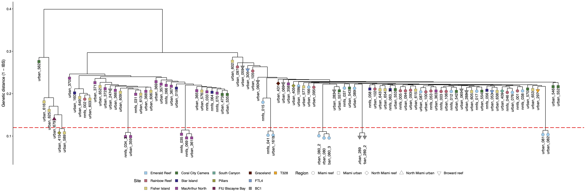
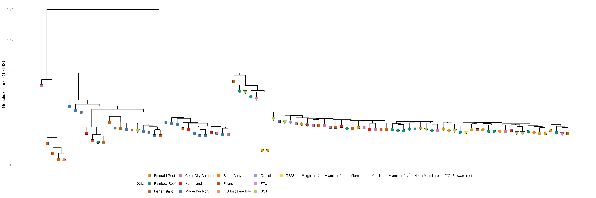

<a href="https://github.com/mstudiva/Urban-coral-population-genetics" class="github-corner" aria-label="View source on GitHub"><svg width="80" height="80" viewBox="0 0 250 250" style="fill:#2C3E50; color:#fff; position: absolute; top: 0; border: 0; right: 0;" aria-hidden="true"><path d="M0,0 L115,115 L130,115 L142,142 L250,250 L250,0 Z"></path><path d="M128.3,109.0 C113.8,99.7 119.0,89.6 119.0,89.6 C122.0,82.7 120.5,78.6 120.5,78.6 C119.2,72.0 123.4,76.3 123.4,76.3 C127.3,80.9 125.5,87.3 125.5,87.3 C122.9,97.6 130.6,101.9 134.4,103.2" fill="currentColor" style="transform-origin: 130px 106px;" class="octo-arm"></path><path d="M115.0,115.0 C114.9,115.1 118.7,116.5 119.8,115.4 L133.7,101.6 C136.9,99.2 139.9,98.4 142.2,98.6 C133.8,88.0 127.5,74.4 143.8,58.0 C148.5,53.4 154.0,51.2 159.7,51.0 C160.3,49.4 163.2,43.6 171.4,40.1 C171.4,40.1 176.1,42.5 178.8,56.2 C183.1,58.6 187.2,61.8 190.9,65.4 C194.5,69.0 197.7,73.2 200.1,77.6 C213.8,80.2 216.3,84.9 216.3,84.9 C212.7,93.1 206.9,96.0 205.4,96.6 C205.1,102.4 203.0,107.8 198.3,112.5 C181.9,128.9 168.3,122.5 157.7,114.1 C157.9,116.9 156.7,120.9 152.7,124.9 L141.0,136.5 C139.8,137.7 141.6,141.9 141.8,141.8 Z" fill="currentColor" class="octo-body"></path></svg></a>

```{=html}
<style>.github-corner:hover .octo-arm{animation:octocat-wave 560ms ease-in-out}@keyframes octocat-wave{0%,100%{transform:rotate(0)}20%,60%{transform:rotate(-25deg)}40%,80%{transform:rotate(10deg)}}@media (max-width:500px){.github-corner:hover .octo-arm{animation:none}.github-corner .octo-arm{animation:octocat-wave 560ms ease-in-out}}</style>
```
#### version: `r library(magrittr)` `r Sys.Date() %>% format(format="%d %B, %Y")`

#### [GitHub repository](https://github.com/mstudiva/Urban-coral-population-genetics){target="_blank"}

## A B O U T &nbsp; T H I S &nbsp; D O C U M E N T

This walkthrough describes the population genetics analysis of SNPs generated from *Orbicella faveolata* samples collected across urbanized and reef habitats in southeast Florida. Sequence alignments are based on an existing genome assembly by Young and colleagues: https://doi.org/10.1186/s12864-024-10092-w. For initial processing of 2bRAD reads regardless of species, and the species-specific 2bRAD pipeline, please see below: 

- [2bRAD processing](https://mstudiva.github.io/Urban-coral-population-genetics/code/)
- [*Orbicella faveolata*](https://mstudiva.github.io/Urban-coral-population-genetics/code/ofav)

Library prep, bioinformatics, and analysis protocols are credited to the 2bRAD pipeline originally developed by Misha Matz: https://doi.org/10.1038/nmeth.2023, and further refined by Ryan Eckert: https://ryaneckert.github.io/ofav_FKNMS_PopGen/code/ 

<br>

#### All analyses preformed with R version `r getRversion()`.

<br>

***
## S E T U P 
***

```{r, setup, include = FALSE}
# setup rmarkdown environment first

knitr::opts_chunk$set(warning = FALSE, fig.align = 'left')
options(width = 88)

library(magrittr)

#setting working directory to the directory containing this .Rmd file
setwd(dirname(rstudioapi::getActiveDocumentContext()$path))
```

### Loading required packages

For the following analyses we will require the use of a number of different R packages. We can use the following code to quickly load in the packages and install any packages not previously installed in the R console.

```{r, load packages, include = TRUE, message = FALSE, warning = FALSE, results = 'hide'}
if (!require("pacman")) install.packages("pacman")

pacman::p_load_gh("pmartinezarbizu/pairwiseAdonis/pairwiseAdonis", "ropensci/rnaturalearthhires", "KarstensLab/microshades")

pacman::p_load("cowplot", "car", "ggrepel", "ggspatial", "paletteer", "patchwork", "rgdal", "rnaturalearth", "sf", "Hmisc", "MCMC.OTU", "pairwiseAdonis", "RColorBrewer", "Redmonder", "flextable", "lubridate", "officer", "adegenet", "dendextend", "gdata", "ggdendro", "hierfstat", "kableExtra", "poppr", "reshape2", "StAMPP", "vcfR", "vegan", "boa", "magick", "rgeos", "sdmpredictors", "ggcorrplot", "tidyverse", "TeachingDemos", "LaplacesDemon", "adespatial", "ggnewscale", "ggbeeswarm", "multcomp", "rstatix", "R.utils", "graph4lg")

options("scipen" = 10)
```

<br>

Making color palettes to use throughout all plots
```{r, palette}
Pal <- c("#E69F00","#009E73","#D55E00","#CC79A7","#E41A1C","#377EB8","#FF7F00","#A65628","#FC8D62","#8DA0CB","#E78AC3","#A6D854","#FFD92F")

kColPal <- c("cornflowerblue","orange","purple4","grey50")
```

<br>

***
## M A P &nbsp; O F &nbsp; S T U D Y &nbsp; S I T E S
***

<br>

***
## P O P U L A T I O N &nbsp; G E N E T I C S &nbsp; A N A L Y S E S 
***

Analyzing 2bRAD generated SNPs (20,323 loci) for population structure/genetic connectivity across urbanized and reef sites in southeast Florida

## Identifiying clonal multi-locus genotypes

### Dendrogram with clones

Identification of any natural clones using technical replicates as a baseline for clonality between samples

```{r, Dendrogram With Clones, fig.width=13, fig.height=4.75, dpi=150, out.width="100%"}
pacman::p_load("dendextend", "ggdendro", "tidyverse")

cloneBams = read.csv("../../data/ofav/ofavMetadata.csv") # list of bam files

cloneMa = as.matrix(read.table("../../data/ofav/ANGSD/clones/ofavClones.ibsMat")) # reads in IBS matrix produced by ANGSD 

dimnames(cloneMa) = list(cloneBams[,2],cloneBams[,2])
clonesHc = hclust(as.dist(cloneMa),"ave")

clonePops = cloneBams$region
cloneSite = cloneBams$site

cloneDend = cloneMa %>% as.dist() %>% hclust(.,"ave") %>% as.dendrogram()
cloneDData = cloneDend %>% dendro_data()

# Making the branches hang shorter so we can easily see clonal groups
cloneDData$segments$yend2 = cloneDData$segments$yend
for(i in 1:nrow(cloneDData$segments)) {
  if (cloneDData$segments$yend2[i] == 0) {
    cloneDData$segments$yend2[i] = (cloneDData$segments$y[i] - 0.01)}}

cloneDendPoints = cloneDData$labels
cloneDendPoints$region = clonePops[order.dendrogram(cloneDend)]
cloneDendPoints$site=cloneSite[order.dendrogram(cloneDend)]
rownames(cloneDendPoints) = cloneDendPoints$label

cloneDendPoints$region = as.factor(cloneDendPoints$region)
cloneDendPoints$site = as.factor(cloneDendPoints$site)

# Making points at the leaves to place symbols for regions
point = as.vector(NA)
for(i in 1:nrow(cloneDData$segments)) {
  if (cloneDData$segments$yend[i] == 0) {
    point[i] = cloneDData$segments$y[i] - 0.01
  } else {
    point[i] = NA}}

cloneDendPoints$y = point[!is.na(point)]

techReps = c("urban_080", "urban_080_2", "urban_080_3", "urban_289", "urban_289_2")
cloneDendPoints$site = factor(cloneDendPoints$site,levels(cloneDendPoints$site)[c(3, 10, 4, 2, 12, 8, 11, 9, 5, 7, 6, 1, 13)])

cloneDendPoints$region = factor(cloneDendPoints$region,levels(cloneDendPoints$region)[c(2, 3, 4, 5, 1)])

cloneDendA = ggplot() +
  geom_segment(data = segment(cloneDData), aes(x = x, y = y, xend = xend, yend = yend2), size = 0.5) +
  geom_point(data = cloneDendPoints, aes(x = x, y = y, fill = site, shape = region), size = 4, stroke = 0.25) +
  # scale_fill_brewer(palette = "Dark2", name = "Site") +
  scale_fill_manual(values = Pal, name= "Site")+
  scale_shape_manual(values = c(21, 22, 23, 24, 25), name = "Region")+
  geom_hline(yintercept = 0.12, color = "red", lty = 5, size = 0.75) + # creating a dashed line to indicate a clonal distance threshold
  geom_text(data = subset(cloneDendPoints, subset = label %in% techReps), aes(x = x, y = (y - .045), label = label), angle = 90) + # spacing technical replicates further from leaf
  geom_text(data = subset(cloneDendPoints, subset = !label %in% techReps), aes(x = x, y = (y - .025), label = label), angle = 90) +
  labs(y = "Genetic distance (1 - IBS)") +
  guides(fill = guide_legend(override.aes = list(shape = 22)))+
  theme_classic()

cloneDend = cloneDendA + theme(
  axis.title.x = element_blank(),
  axis.text.x = element_blank(),
  axis.line.x = element_blank(),
  axis.ticks.x = element_blank(),
  axis.title.y = element_text(size = 12, color = "black", angle = 90),
  axis.text.y = element_text(size = 10, color = "black"),
  axis.line.y = element_line(),
  axis.ticks.y = element_line(),
  panel.grid = element_blank(),
  panel.border = element_blank(),
  panel.background = element_rect(fill = "white", colour = NA),
  plot.background  = element_rect(fill = "white", colour = NA),
  legend.key = element_blank(),
  legend.title = element_text(size = 12),
  legend.text = element_text(size = 10),
  legend.position = "bottom")

cloneDend

ggsave("../../figures/ofav/cloneDend.pdf", plot = cloneDend, height = 8, width = 24, units = "in", dpi = 300)
ggsave("../../figures/ofav/cloneDend.png", plot = cloneDend, height = 8, width = 24, units = "in", dpi = 300)
```


<br>

### Dendrogram without clones
We removed the technical replicates/clones and re-ran ANGSD for all the following analyses

```{r, Dendrogram Without Clones, fig.width=13, fig.height=4.75, dpi=150, out.width="100%"}
pacman::p_load("dendextend", "ggdendro", "tidyverse")

bams = read.csv("../../data/ofav/ofavMetadata.csv")[-c(11,14,22,32:34,54,59,72),] # list of bams files and their populations (tech reps removed)

ma = as.matrix(read.table("../../data/ofav/ANGSD/ofavNoClones.ibsMat")) # reads in IBS matrix produced by ANGSD

dimnames(ma) = list(bams[,2],bams[,2])
Hc = hclust(as.dist(ma),"ave")

Pops = bams$region
Site = bams$site

Dend = ma %>% as.dist() %>% hclust(.,"ave") %>% as.dendrogram()
DData = Dend %>% dendro_data()

# Making the branches hang shorter so we can easily see clonal groups
DData$segments$yend2 = DData$segments$yend
for(i in 1:nrow(DData$segments)) {
  if (DData$segments$yend2[i] == 0) {
    DData$segments$yend2[i] = (DData$segments$y[i] - 0.01)}}

DendPoints = DData$labels
DendPoints$region = Pops[order.dendrogram(Dend)]
DendPoints$site=Site[order.dendrogram(Dend)]
rownames(DendPoints) = DendPoints$label

DendPoints$region = as.factor(DendPoints$region)
DendPoints$site = as.factor(DendPoints$site)

# Making points at the leaves to place symbols for regions
point = as.vector(NA)
for(i in 1:nrow(DData$segments)) {
  if (DData$segments$yend[i] == 0) {
    point[i] = DData$segments$y[i] - 0.01
  } else {
    point[i] = NA}}

DendPoints$y = point[!is.na(point)]

DendPoints$site = factor(DendPoints$site,levels(DendPoints$site)[c(3, 10, 4, 2, 12, 8, 11, 9, 5, 7, 6, 1, 13)])

DendPoints$region = factor(DendPoints$region,levels(DendPoints$region)[c(2, 3, 4, 5, 1)])

DendA = ggplot() +
  geom_segment(data = segment(DData), aes(x = x, y = y, xend = xend, yend = yend2), size = 0.5) +
  geom_point(data = DendPoints, aes(x = x, y = y, fill = site, shape = region), size = 4, stroke = 0.25) +
  # scale_fill_brewer(palette = "Dark2", name = "Site") +
  scale_fill_manual(values = Pal, name= "Site")+
  scale_shape_manual(values = c(21, 22, 23, 24, 25), name = "Region")+
  labs(y = "Genetic distance (1 - IBS)") +
  guides(fill = guide_legend(override.aes = list(shape = 22)))+
  theme_classic()

Dend = DendA + theme(
  axis.title.x = element_blank(),
  axis.text.x = element_blank(),
  axis.line.x = element_blank(),
  axis.ticks.x = element_blank(),
  axis.title.y = element_text(size = 12, color = "black", angle = 90),
  axis.text.y = element_text(size = 10, color = "black"),
  axis.line.y = element_line(),
  axis.ticks.y = element_line(),
  panel.grid = element_blank(),
  panel.border = element_blank(),
  panel.background = element_rect(fill = "white", colour = NA),
  plot.background  = element_rect(fill = "white", colour = NA),
  legend.key = element_blank(),
  legend.title = element_text(size = 12),
  legend.text = element_text(size = 10),
  legend.position = "bottom")

Dend

ggsave("../../figures/ofav/Dend.pdf", plot = Dend, height = 8, width = 24, units = "in", dpi = 300)
ggsave("../../figures/ofav/Dend.png", plot = Dend, height = 8, width = 24, units = "in", dpi = 300)
```


<br>

## Population structure

### PCA

```{r, pcangsd}
pcangsd = read.csv("../../data/ofav/ofavMetaData.csv")[-c(11,14,22,32:34,54,59,72),] %>% dplyr::select("sample" = sampleID, "region" = region, "site" = site)

site_order <- c(
  "Emerald Reef",
  "Rainbow Reef",
  "Fisher Island",
  "Coral City Camera",
  "Star Island",
  "MacArthur North",
  "South Canyon",
  "Pillars",
  "FIU Biscayne Bay",
  "Graceland",
  "FTL4",
  "BC1",
  "T328"
)

site_factor <- factor(pcangsd$site, levels = site_order)
ord <- order(site_factor)

pcangsd <- pcangsd[ord, ]

pcangsd$regionsite = as.factor(paste(pcangsd$region, pcangsd$site, sep = " "))

pcangsd$regionsite = factor(pcangsd$regionsite, levels(pcangsd$regionsite)[c(4, 5, 7, 6, 9, 8, 12, 11, 13, 10, 2, 1, 3)])

pcangsd$site = factor(pcangsd$site)
pcangsd$site = factor(pcangsd$site, levels(pcangsd$site)[c(3, 10, 4, 2, 12, 8, 11, 9, 5, 7, 6, 1, 13)])

pcangsd$region = factor(pcangsd$region)
pcangsd$region = factor(pcangsd$region, levels(pcangsd$region)[c(2, 3, 4, 5, 1)])

cov = read.table("../../data/ofav/pcangsd/ofavPcangsd.cov") %>% as.matrix()
cov <- cov[ord, ord]

pcAdmix = read.table("../../data/ofav/structure_selector/K=3/MajorCluster/CLUMPP.files/ClumppIndFile.output") %>% dplyr::select(V6, V7, V8)
pcAdmix %>% summarise(sum(V6),sum(V7), sum(V8)) 

pcAdmix = pcAdmix %>% rename("cluster1" = "V6", "cluster2" = "V7", "cluster3" = "V8") %>%dplyr::select(order(colnames(.)))
  
pcaEig = eigen(cov)
ofavPcaVar = pcaEig$values/sum(pcaEig$values)*100
head(ofavPcaVar)

pcangsd$PC1 = pcaEig$vectors[,1]
pcangsd$PC2 = pcaEig$vectors[,2]
pcangsd$PC3 = pcaEig$vectors[,3]
pcangsd$PC4 = pcaEig$vectors[,4]

pcangsdClust = pcAdmix %>% mutate(cluster = ifelse(cluster1 < 0.75 & cluster2 < 0.75  & cluster3 < 0.75, "NA", ifelse(cluster1 >=0.75, 1, ifelse(cluster2 >= 0.75, 2, ifelse(cluster3 >= 0.75, 3, 0)))))

# pcangsdClust$clusterX = as.vector(d_clust$classification)

pcangsd = pcangsd %>% mutate(pcangsdClust)

pcangsd$cluster = as.factor(pcangsd$cluster)
levels(pcangsd$cluster) = c("Blue", "Orange", "Purple", "Admixed")

bamsClusters = pcangsd %>% dplyr::select(sample, cluster) %>% dplyr::arrange(sample) 
bamsSamples = read.delim("../../data/ofav/ANGSD/bamsNoClones", header = FALSE)
bamsClusters$sample = bamsSamples$V1

# bamsClusters = as.data.frame(bamsClusters)

write.table(x = bamsClusters, file = "../../data/ofav/ANGSD/bamsClusters", sep = "\t", row.names = FALSE, col.names = FALSE, quote = FALSE)
# scp bamsClusters to HPC

pcangsd = merge(pcangsd, aggregate(cbind(mean.x = PC1, mean.y = PC2)~regionsite, pcangsd, mean), by="regionsite")

adonis2(pcangsd[,c(9:11)]~region*site, data = pcangsd, method = "euclidean", by = "terms")
```

```{r}
pcangsd %>% group_by(region,cluster) %>% summarise(n = n())
```

Plot PCA

```{r, pca plots}
pcaTheme = theme(axis.title.x = element_text(color = "black", size = 10),
        axis.text.x = element_blank(),
        axis.ticks.x = element_blank(),
        axis.line.x = element_blank(),
        axis.title.y = element_text(color = "black", size = 10),
        axis.text.y = element_blank(),
        axis.ticks.y = element_blank(),
        axis.line.y = element_blank(),
        legend.position = "none",
        legend.title = element_text(size = 8),
        legend.text = element_text(size = 8),
        legend.key.size = unit(5, "pt"),
        panel.border = element_rect(color = "black", size = 1),
        panel.grid.major = element_blank(),
        panel.grid.minor = element_blank())

pcaPlot12SA = ggplot() +
  geom_hline(yintercept = 0, color = "gray90", size = 0.25) +
  geom_vline(xintercept = 0, color = "gray90", size = 0.25) +
  geom_point(data = pcangsd, aes(x = PC1, y = PC2, fill = site, shape = region, color = site), stroke = 0, size = 2.5, alpha = 0.5, show.legend = FALSE) +
  geom_point(data = pcangsd, aes(x = mean.x, y = mean.y, fill = site, shape = region), color = "black", size = 2.75, alpha = 1, stroke = 0.25) +
  scale_shape_manual(values = c(21, 22, 23, 24, 25), name = "Region") +
  scale_fill_manual(values = Pal, name = "Site") +
  scale_color_manual(values = Pal, name = "Site") +
  labs(x = paste0("PC 1 (", format(round(ofavPcaVar[1], 1), nsmall = 1)," %)"), y = paste0("PC 2 (", format(round(ofavPcaVar[2], 1), nsmall = 1), " %)")) +
  guides(shape = guide_legend(override.aes = list(size = 2, stroke = 0.25, alpha = NA), order = 2, ncol = 1), fill = guide_legend(override.aes = list(shape = 22, size = 2, fill = Pal, alpha = NA), order = 1, ncol = 1)) +
  theme_bw()

pcaPlot12S = pcaPlot12SA +
  pcaTheme +
  theme(legend.position = c(0.1, 0.67))

pcaPlot12S


pcaPlot12LA = ggplot() +
  geom_hline(yintercept = 0, color = "gray90", size = 0.5) +
  geom_vline(xintercept = 0, color = "gray90", size = 0.5) +
  geom_point(data = pcangsd, aes(x = PC1, y = PC2, fill = cluster, shape = region), color = "black", size = 2, alpha = 1, show.legend = TRUE) +
  scale_shape_manual(values = c(21, 22, 23, 24, 25), name = "region Zone") +
  scale_fill_manual(values = kColPal, name = "Lineage") +
  labs(x = paste0("PC 1 (", format(round(ofavPcaVar[1], 1), nsmall = 1)," %)"), y = paste0("PC 2 (", format(round(ofavPcaVar[2], 1), nsmall = 1), " %)")) +
  guides(shape = "none", fill = guide_legend(override.aes = list(shape = 22, size = 2, fill = kColPal, alpha = NA), order = 1, ncol = 1))+
  theme_bw()

pcaPlot12L = pcaPlot12LA +
  pcaTheme +
  theme(legend.position = c(0.85,0.15))

pcaPlot23LA = ggplot() +
  geom_hline(yintercept = 0, color = "gray90", size = 0.5) +
  geom_vline(xintercept = 0, color = "gray90", size = 0.5) +
  geom_point(data = pcangsd, aes(x = PC3, y = PC2, fill = cluster, shape = region), color = "black", size = 2, alpha = 1, show.legend = TRUE) +
  scale_shape_manual(values = c(21, 22, 23, 24, 25), name = "region Zone") +
  scale_fill_manual(values = kColPal, name = "Lineage") +
  labs(x = paste0("PC 3 (", format(round(ofavPcaVar[3], 1), nsmall = 1)," %)"), y = paste0("PC 2 (", format(round(ofavPcaVar[2], 1), nsmall = 1), " %)")) +
  guides(shape = guide_legend(override.aes = list(size = 2, stroke = 0.5, alpha = NA), order = 2, ncol = 1), fill = guide_legend(override.aes = list(shape = 22, size = 2, fill = kColPal, alpha = NA), order = 1, ncol = 1, byrow = TRUE))+
  theme_bw()

pcaPlot23L = pcaPlot23LA +
  pcaTheme

```

Put all plots together
```{r, pca 1 plot}
pcaPlots = ((pcaPlot12S + theme(axis.title.y = element_text(margin = ggplot2::margin(r = -20, unit = "pt")))) | pcaPlot12L | pcaPlot23L) +
  plot_annotation(tag_levels = 'A') &
  theme(plot.tag = element_text(size = 18),
        panel.background = element_rect(fill = "white"),
        legend.spacing = unit(-5, "pt"),
        legend.key = element_blank(),
        legend.background = element_blank())

pcaPlots

```

<br> 

## Lineage demographics

### Lineage differentiation
Measuring with global weighted FST calculated from SFS
First prepare and sort FST for plotting
```{r}
pop.order = c("Blue", "Orange", "Purple")

# reads in fst 
fstMa1 <- read.delim("../../data/ofav/SFS/ofavKFst.out") %>% dplyr::select(-fst) %>% df_to_pw_mat(., "pop1", "pop2", "weightedFst")

fstMa1
fstMa = fstMa1

upperTriangle(fstMa, byrow = TRUE) <- lowerTriangle(fstMa)
fstMa <- fstMa[,pop.order] %>%
  .[pop.order,]
fstMa[upper.tri(fstMa)] <- NA
fstMa <- as.data.frame(fstMa)

# rearrange and reformat matrix
fstMa$Pop = factor(row.names(fstMa), levels = unique(pop.order))


# melt matrix data (turn from matrix into long dataframe)
fst = melt(fstMa, id.vars = "Pop", value.name = "Fst", variable.name = "Pop2", na.rm = FALSE)

fst$Fst = round(fst$Fst, 3)

fst$site = fst$Pop
fst$site = factor(gsub("\\n.*", "", fst$site))
fst$site = factor(fst$site, levels = levels(fst$site)[c(1, 2, 3)])

fst$site2 = fst$Pop2
fst$site2 = factor(gsub("\\n.*", "", fst$site2))
fst$site2 = factor(fst$site2, levels = levels(fst$site2)[c(1, 2, 3)])

fst$Pop2 = factor(fst$Pop2, levels = levels(fst$Pop2)[c(3, 2, 1)])

```

Construct a heatmap of FST values

```{r, fstPlot}
fstHeatmapA = ggplot(data = fst %>% filter(Fst != 0), aes(Pop, Pop2, fill = as.numeric(as.character(Fst)))) +
  geom_tile(color = "white") +
  geom_segment(data = fst, aes(x = 0.475, xend = 0.25, y = Pop2, yend = Pop2, color = site2), size = 21.25) + #colored boxes for Y-axis labels
  geom_segment(data = fst, aes(x = Pop, xend = Pop, y = 0.2, yend = 0.475, color = site), size = 41) + #colored boxes for X-axis labels
  scale_color_manual(values = kColPal, guide = NULL) +
  scale_fill_gradient(low = "white", high = "#EA526F", limit = c(0, 0.79), space = "Lab", name = expression(paste(italic("F")[ST])), na.value = NA,  guide = "colourbar") +

  geom_text(data = fst %>% filter(Fst != 0), aes(Pop, Pop2, label = Fst), color = "black", size = 3.5, fontface = "bold") +
  guides(fill = guide_colorbar(barwidth = 7.5, barheight = 0.75, title.position = "top", title.hjust = 0.5, direction = "horizontal", ticks.colour = "black", frame.colour = "black")) +
  scale_y_discrete(position = "left", limits = rev(levels(fst$Pop2))) +
  scale_x_discrete(limits = levels(fst$Pop2)[c(1:3)]) +
  coord_cartesian(xlim = c(1, 4), ylim = c(1, 4), clip = "off") +
  theme_minimal()

fstHeatmap = fstHeatmapA + theme(
  axis.text.x = element_text(vjust = 3.5, size = 10, hjust = 0.5, color = "black"),
  axis.text.y = element_text(size = 10, color = "black", angle = 90, hjust = 0.5, vjust = -1.5),
  axis.title.x = element_blank(),
  axis.title.y = element_blank(),
  panel.grid.major = element_blank(),
  panel.border = element_blank(),
  axis.ticks = element_blank(),
  legend.title = element_text(size = 8, color = "black"),
  legend.text = element_text(size = 8, color = "black"),
  legend.position = c(0.6, 0.9),
  plot.background = element_blank(),
  panel.background = element_blank(),
)

fstHeatmap
```

<br>

### Lineage demographics through time

Making stairway plot of effective population sizes of each lineage throughout time

```{r, stairway plot}
bl = read.table("../../data/ofav/SFS/ofavBlue.final.summary", header = TRUE) %>% mutate("Lineage" = "Blue")
or = read.table("../../data/ofav/SFS/ofavOrange.final.summary", header = TRUE) %>% mutate("Lineage" = "Orange")
pr = read.table("../../data/ofav/SFS/ofavPurple.final.summary", header = TRUE) %>% mutate("Lineage" = "Purple")

swData = rbind(bl, or, pr)
swData$Lineage = factor(swData$Lineage)
swData$Lineage = factor(swData$Lineage, levels = levels(swData$Lineage)[c(1,2,3)])

```

Constuct plot
```{r, swPlot}
swPlotA = ggplot(data = swData, aes(x = year, y = Ne_median, ymin = Ne_12.5., ymax = Ne_87.5., color = Lineage, fill = Lineage)) +
  geom_ribbon(color = NA, aes(alpha = Lineage)) +
  # geom_line(size = 0.6) +
  geom_line(linewidth = 1.15) +
  scale_fill_manual(values = kColPal[c(1:3)]) +
  scale_color_manual(values = kColPal[c(1:3)]) +
  scale_alpha_manual(values = c(0.25, 0.25, 0.35)) +
  scale_x_reverse(name = "KYA", limits = c(0,5.25e5), breaks = c(1e5,2e5,3e5,4e5,5e5), labels = c("100","200", "300", "400", "500")) +
  scale_y_continuous(name = bquote(italic(N[e])~"(x10"^"3"*")"), limits = c(0,3.5e5), breaks = c(1e5,2e5,3e5, 4e5), labels = c("100","200", "300","400"))+

  coord_cartesian(xlim = c(5.25e5, 0), expand = FALSE) +
  theme_bw()

swPlot = swPlotA + theme(
    axis.title = element_text(color = "black", size = 12),
    axis.text = element_text(color = "black", size = 10),
    legend.key.size = unit(0.3, 'cm'),
    legend.title = element_text(color = "black", size = 12),
    legend.text = element_text(color = "black", size = 12),
    legend.position = "none",
    # legend.position = c(0.85, 0.82),
    plot.background = element_blank(),
    panel.background = element_blank(),
    panel.border = element_rect(size = 1),
    panel.grid = element_blank()
)

swPlot

```

<br>

### Heterozygosity and Inbreeding

```{r, popStats}
popData = read.csv("../../data/ofav/ofavMetaData.csv")[-c(11,14,22,32:34,54,59,72),] %>% dplyr::select("sample" = sampleID, "region" = region, "site" = site) # Reads in population data
popData$a = c(0:93)

popData$site = factor(popData$site)
popData$site = factor(popData$site, levels = levels(popData$site)[c(3, 10, 4, 2, 12, 8, 11, 9, 5, 7, 6, 1, 13)]) 
popData$region = factor(popData$region)
popData$region = factor(popData$region, levels = levels(popData$region)[c(2, 3, 4, 5, 1)]) 

# sampleData = fknmsSites[-c(66,68,164,166,209,211),] %>% group_by(site, depthZone)%>% summarise(depthZone = (first(depthZone)), depthRange = paste(min(depthM), "--", max(depthM), sep = ""), meanDepth = round(mean(depthM),1), n = n())%>% droplevels() %>% as.data.frame()
# 
# sampleTab = sampleData
# colnames(sampleTab) = c("Site", "Depth zone", "Sampling \ndepth (m)", "Average \ndepth (m)", "n")
# 
# sampleTab$Site
# finalTabSite = c("Upper Keys", "", "Lower Keys","", "Tortugas Bank", "", "Riley's Hump", "")
# 
# sampleTab$Site = finalTabSite
# 
hetAll = read.table("../../data/ofav/SFS/ofavHet") 
colnames(hetAll) = c("sample", "He")
hetAll$sample <- popData$sample

ofavBreed = read.delim("../../data/ofav/SFS/ofavF.indF", header = FALSE)

ofavRelate = read.delim("../../data/ofav/SFS/ofavFiltRelate")
ofavRelate2 = ofavRelate %>% group_by(a, b) %>% dplyr::select("Rab" = rab, "theta" = theta)

ofavRelate2 = ofavRelate2 %>% left_join(popData, by = "a") %>% left_join(popData, by = c("b" = "a"), suffix = c(".a", ".b")) 

ofavRelate2$regionsite.a = paste(ofavRelate2$region.a, ofavRelate2$site.a, sep = " ")
ofavRelate2$regionsite.b = paste(ofavRelate2$region.b, ofavRelate2$site.b, sep = " ")

ofavRelate2 = ofavRelate2 %>% left_join((pcangsd %>%dplyr::select(sample, cluster)) , by = c("sample.a" = "sample")) %>% left_join((pcangsd %>%dplyr::select(sample, cluster)) , by = c("sample.b" = "sample"))

ofavRelate = ofavRelate2 %>% filter(cluster.x != "Admixed",cluster.x == cluster.y) %>% rename(region = region.a, site = site.a, cluster = cluster.x)

ofavRelateMean = ofavRelate %>% group_by(region, site) %>% dplyr::summarize(N = n(), meanRab = mean(Rab), seRab = sd(Rab)/sqrt(N), meanTheta = mean(theta), seTheta = sd(theta)/sqrt(N)) %>% dplyr::select(-N)

het = left_join(popData, hetAll, by = "sample") %>% mutate("inbreed" = ofavBreed$V1) %>% left_join((pcangsd %>% dplyr::select(sample, cluster)) , by = "sample") %>% dplyr::select(-a)

hetStats = het %>% group_by(cluster) %>% summarise(N = n(), meanAll = mean(He), sdAll = sd(He), seAll = sd(He)/sqrt(N), meanInbreed = mean(inbreed), sdInbreed = sd(inbreed), seInbreed = sd(inbreed)/sqrt(N))

hetStats
```

### Heterozygosity, diversity, and inbreeding plots

Heterozygosity across all RAD loci by lineage

```{r, het lineage plot}
leveneTest(lm(He ~ cluster, data = subset(het, subset = pcangsd$cluster!="Admixed")))
# p = 0.0004142

hetAov = welch_anova_test(He ~ cluster, data = subset(het, subset = het$cluster!="Admixed"))
# p = 0.021

hF = hetAov$statistic[[1]]

hetPH = games_howell_test(He ~ cluster, data = subset(het, subset = het$cluster!="Admixed"), conf.level = 0.95) %>% as.data.frame()
# He	Blue	Orange	0.00078199234	0.0002437016	0.00132028307	0.003	**
# He	Blue	Purple	0.00003888889	-0.0005539790	0.00063175673	0.971	ns
# He	Orange	Purple	-0.00074310345	-0.0014110593	-0.00007514763	0.028	*

hetLetters = data.frame(x = factor(c("Blue", "Orange", "Purple")), y = c(0.0065, 0.0065, 0.0065),  grp = c("a", "b", "a"))
lab_str <- sprintf("italic(F) == %.2f ~ ', ' ~ italic(p) == %.3f", hF, 0.021)

hetPlotKA = ggplot(data = het %>% filter(cluster != "Admixed"), aes(x = cluster, y = He)) +
  geom_beeswarm(aes(fill = cluster), shape = 21, size = 2, cex = 0.75, alpha = 0.5) + 
  geom_violin(aes(fill = cluster, group = cluster), adjust = 1, linewidth = 0, color = "black", alpha = 0.35, width = 0.9, trim = F, scale = "width") +
  geom_violin(aes(fill = cluster, group = cluster), adjust = 1, linewidth = 0.4, color = "black", alpha = 1, width = 0.9, trim = F, fill = NA, scale = "width") +
  geom_boxplot(aes(fill = cluster, group = cluster), width = 0.2, color = "black", fill = "white", outlier.colour = NA, linewidth = 0.6, alpha = 0.5) +  xlab("Lineage") +
  geom_text(data = hetLetters, aes(x = x, y = y, label = grp), size = 4) +
   annotate(
  geom  = "text",
  x     = 1,
  y     = 0,
  label = lab_str,
  parse = TRUE,
  size  = 3
) +
  scale_fill_discrete(type = kColPal, name = "Lineage") +
  xlab("Lineage") +
  ylab("Heterozygosity") +
  # coord_cartesian(expand = TRUE, xlim = c(0.85, 4)) +
  theme_bw()

 hetPlotK = hetPlotKA + theme(
        axis.title = element_text(color = "black", size = 12),
        axis.text = element_text(color = "black", size = 10),
        legend.position = "none",
        legend.key.size = unit(0.3, 'cm'),
        panel.border = element_rect(color = "black", size = 1),
        panel.background = element_blank(),
        plot.background = element_blank(),
        panel.grid.major = element_blank(),
        panel.grid.minor = element_blank())

hetPlotK
```


### Mean inbreeding plot

```{r, inbreeding violin}
leveneTest(lm(inbreed ~ cluster, data = subset(het, subset = pcangsd$cluster!="Admixed")))

ibAov = welch_anova_test(inbreed ~ cluster, data = subset(het, subset = het$cluster!="Admixed"))

iF = ibAov$statistic[[1]]

ibPH = games_howell_test(inbreed ~ cluster, data = subset(het, subset = het$cluster!="Admixed"), conf.level = 0.95) %>% as.data.frame()

inbreedLetters = data.frame(x = factor(c("Blue", "Orange", "Purple")), y = c(0.8, 0.8, 0.8),  grp = c("a", "b", "c"))
lab_str <- sprintf("italic(F) == %.2f ~ ', ' ~ italic(p) < 0.001", hF)

inbreedingPlot = ggplot(data = het %>% filter(cluster!="Admixed"), aes(x = cluster, y = inbreed)) +
  geom_beeswarm(aes(fill = cluster), shape = 21, size = 2, cex = 1.5, alpha = 0.5) +
  geom_violin(aes(fill = cluster), adjust = 1, linewidth = 0, color = "black", alpha = 0.35, width = 0.9, trim = F, scale = "width") +
  geom_violin(adjust = 1, linewidth = 0.4, color = "black", alpha = 1, width = 0.9, trim = F, fill = NA, scale = "width") +
  geom_boxplot(aes(fill = cluster),width = 0.2, color = "black", fill = "white", outlier.colour = NA, linewidth = 0.6, alpha = 0.5) + 
  geom_text(data = inbreedLetters, aes(x = x, y = y, label = grp), size = 4) +
  annotate(
  geom  = "text",
  x     = 1,
  y     = -0.1,
  label = lab_str,
  parse = TRUE,
  size  = 3
) +
  xlab("Lineage") +
  ylab(bquote(~"Inbreeding coefficient ("*italic(F)*")")) +
  scale_fill_manual(values = kColPal) +  
  scale_color_manual(values = kColPal) +
  # scale_y_continuous(breaks=seq(0, 0.8, by = .05)) +
  # coord_cartesian(expand = TRUE, xlim = c(0.78, 4)) +
  theme_bw() +
  theme(legend.position = "none",
        axis.text = element_text(size = 10, color = "black"),
        axis.title = element_text(size = 12, color = "black"),
        panel.border = element_rect(color = "black", size = 1),
        plot.background = element_blank(),
        panel.grid.major = element_blank(),
        panel.grid.minor = element_blank())

inbreedingPlot
```

### Nucleotide diversity plot

```{r, pi}
# mean depth for lineages
subset(pcangsd, subset = pcangsd$cluster!="Admixed") %>% group_by(cluster) 

npgList = list(read_tsv("../../data/ofav/SFS/blue.thetas.idx.pestPG") %>% mutate(lineage = "Blue"),
               read_tsv("../../data/ofav/SFS/orange.thetas.idx.pestPG") %>% mutate(lineage = "Orange"),
               read_tsv("../../data/ofav/SFS/purple.thetas.idx.pestPG") %>% mutate(lineage = "Purple"))

piAll = purrr::reduce(npgList, rbind) %>% 
  group_by(lineage) %>% 
  mutate(tPps = tP/nSites)
  # dplyr::summarize(tPps = mean(tPps))

piAll$lineage = as.factor(piAll$lineage)
piAll$lineage = factor(piAll$lineage, levels(piAll$lineage)[c(1, 2, 3)])

lmpi = lm(tPps~lineage, data=piAll)
summary(lmpi)

r2 = round(summary(lmpi)$r.squared, 3)
F = round(summary(lmpi)$fstatistic[1], 2)

nuclDivLetters = data.frame(x = factor(c("Blue", "Orange", "Purple")), y = c(0.8, 0.8, 0.8),  grp = c("a", "b", "c"))
lab_str <- sprintf("italic(F) == %.2f ~ ', ' ~ italic(p) < 0.001", hF)

nuclDivPlot = ggplot(piAll, aes(x = lineage, y = tPps)) +
  geom_smooth(se = F, color = 'black', method='lm', linewidth = 0.75) +
  geom_point(aes(fill = lineage),shape = 21, size = 3) +
  scale_color_manual(values = kColPal) +
  scale_fill_manual(values = kColPal) +
  labs(x='Lineage', y = bquote("Nucleotide diversity ("*pi*")"), shape = 'Lineage') +
  annotate(
  geom  = "text",
  x     = 1,
  y     = 0,
  label = lab_str,
  parse = TRUE,
  size  = 3
) +
  theme_bw() +
  theme(axis.title.y = element_text(color = "black", size = 12),
        axis.title.x = element_text(color = "black", size = 12),
        axis.text = element_text(color = "black", size = 10),
        legend.position = "none",
        legend.key.size = unit(0.3, 'cm'),
        panel.border = element_rect(color = "black", size = 1),
        panel.background = element_blank(),
        plot.background = element_blank(),
        panel.grid.major = element_blank(),
        panel.grid.minor = element_blank())

nuclDivPlot
```


```{r, Ne}
piAll$Ne = (piAll$tPps)/(4*2e-8)
piAll

subset(pcangsd, subset = pcangsd$cluster!="Admixed") %>% group_by(cluster)
```

### Lineage plots
```{r, lineage plots}
lineagePlots = (pcaPlot12L | hetPlotK | inbreedingPlot) / ( swPlot | fstHeatmap) +
  plot_annotation(tag_levels = "A") &
  theme(plot.tag = element_text(size = 14))

# lineagePlots

ggsave("../../figures/ofav/SFS.png", plot = lineagePlots, height = 7, width = 12, units = "in", dpi = 300)

# ggsave("../../figures/ofav/SFS.svg", plot = lineagePlots, height = 7, width = 12, units = "in", dpi = 300)
```

<br> 

## Isolation by distance
### *O. faveolata* isolation by distance

#### Mantel's test
```{r, SNP mantel}
# Isolation by distance
library(geosphere)

#Get the geographic distances in km

coords  = read.csv("../../data/ofav/ofavMetaData.csv")[-c(11,14,22,32:34,54,59,72),] %>% 
  dplyr::select(longitude, latitude)

dGeo = as.dist((distm(coords, fun = distGeo)/1000), diag = TRUE)
snpDist = as.dist(read.table("../../data/ofav/SFS/ofavFiltSnps.ibsMat"), diag = TRUE)

# Test IBD
set.seed(694)
snpIBD = mantel.randtest(dGeo, snpDist, nrepet = 9999)
snpIBD

```

#### SNP Mantel plot
```{r, SNP mantel plot, fig.dim = c(4.9, 4.9)}
snpGenDist =  melt(as.matrix(snpDist), varnames = c("row", "col"), value.name = "dist")
snpGenDist = snpGenDist[snpGenDist$row != snpGenDist$col,]

geo = melt(as.matrix(dGeo), varnames = c("row", "col"), value.name = "geo")
geo = geo[geo$row != geo$col,]

snpMantelDF = data.frame(cbind(snpGenDist$dist, geo$geo))
colnames(snpMantelDF) = c("dist", "geo")

snpMantelA = ggplot(data = snpMantelDF, aes(x = geo, y = dist)) +
  scale_fill_gradientn(colors = paletteer_d("wesanderson::Zissou1")) +
  stat_density_2d(aes(fill = stat(density)), n = 300, contour = FALSE, geom = "raster") +
  geom_smooth(method = lm, col = "black", fill = "gray40", fullrange = TRUE) +
  geom_point(shape = 21, fill = "gray40", alpha = 0.25) +
  # scale_x_continuous(limits = c(0,300), expand = c(0,0)) +
  # scale_y_continuous(limits = c(0.25,0.5), breaks = seq(0.25,0.5, by = 0.05), expand = c(0,0)) +
  annotate("label", x = 40, y = 0.05, 
           label = paste("r = ", round(snpIBD$obs, 3), "; p = ", snpIBD$pvalue), 
           size = 4, alpha = 0.6) +             
  labs(x = "Geographic distance (km)", y = expression(paste("Genetic distance "))) +
  ggtitle("Isolation by Distance (IBD)") +
  theme_bw()

snpMantel = snpMantelA + theme(
  axis.title.x = element_blank(),
  axis.text.x = element_text(size = 12, color = "black"),
  axis.ticks.x = element_line(color = "black"),
  axis.line.x = element_blank(),
  axis.title.y = element_text(color = "black"),
  axis.text.y = element_text(size = 12, color = "black"),
  axis.ticks.y = element_line(color = "black"),
  axis.line.y = element_blank(),
  panel.border = element_rect(size = 1.2, color = "black"),
  plot.margin = margin(0.2,0.5,0.1,0.1, unit = "cm"),
  legend.position = "none")

snpMantel
ggsave("../../figures/ofav/Mantel.png", plot = snpMantel, height = 4, width = 6, units = "in", dpi = 300)

```

<br> 